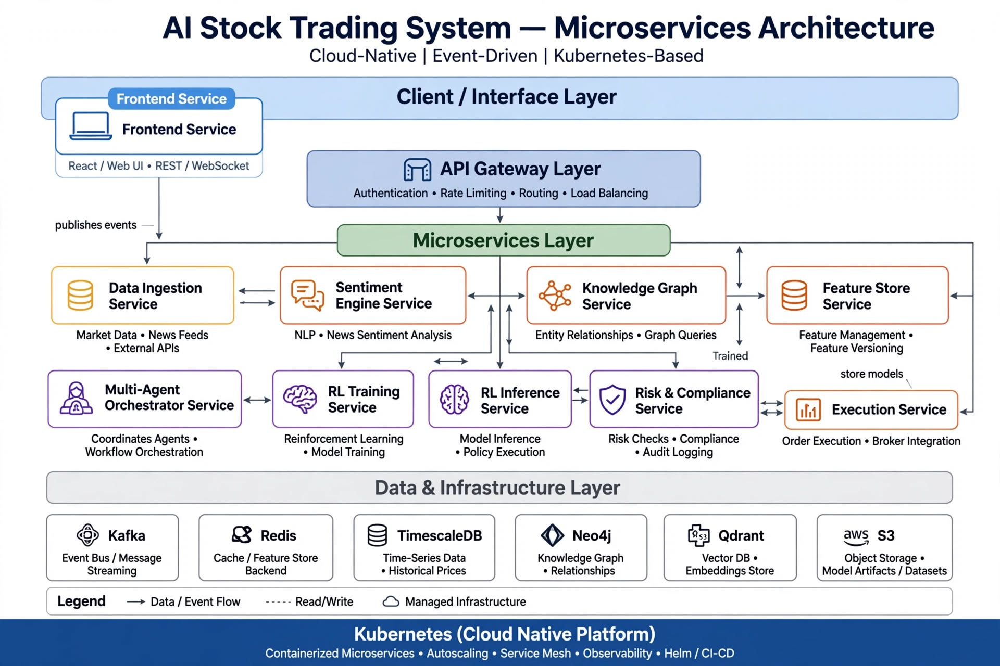
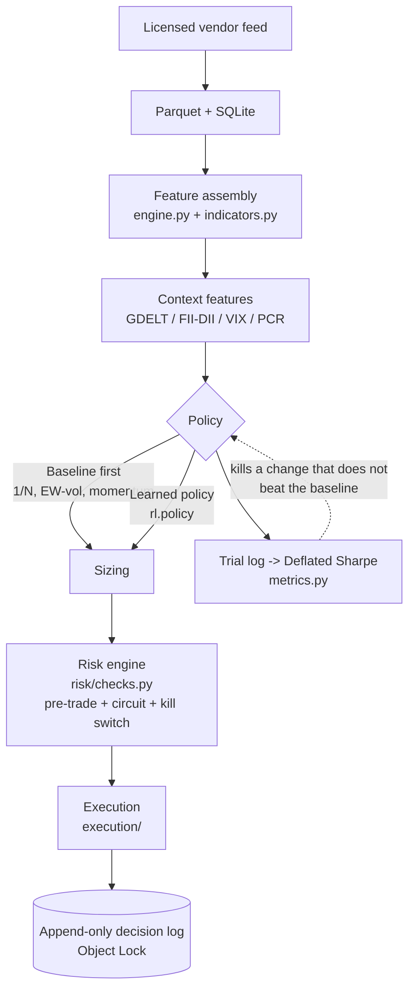

# NIFTY-RL Alpha Engine - Technical Documentation

**Version:** 1.1.0 | **Date:** 2026-10-05 | **Market:** NSE India - Nifty 50
**Author:** RL + Capital Markets Team | **Location:** Kochi, India (ap-south-1)

> **Revision 1.1 — corrected against the research corpus.**
>
> Version 1.0 of this document contained claims that later research
> found to be fabricated, incorrect, or measured to lose money. It also
> described an architecture and a cost base that were off by roughly an
> order of magnitude. Those claims have been **corrected or removed, and
> the removal is stated inline** at each point rather than left silent.
>
> The canonical record of what was wrong and what the evidence actually
> says is
> **[research/corrections-to-design-docs.md](research/corrections-to-design-docs.md)**.
> It is the authority for this document, not the other way round. Where
> the two appear to differ, the research file wins and this document is
> the bug.
>
> Start there before reading anything else.

---

## Table of Contents

1. [Executive Summary](#1-executive-summary)
2. [System Overview](#2-system-overview)
3. [Architecture Diagrams](#3-architecture-diagrams)
4. [Deployment Shape](#4-deployment-shape)
5. [Training Pipeline](#5-training-pipeline)
6. [Inference Pipeline](#6-inference-pipeline)
7. [Frontend Design](#7-frontend-design)
8. [Data Layer & Storage](#8-data-layer--storage)
9. [Data Licensing & Legal Compliance](#9-data-licensing--legal-compliance)
10. [Orchestration, Scaling & Deployment](#10-orchestration-scaling--deployment)
11. [Security, Risk & Compliance](#11-security-risk--compliance)
12. [Observability & MLOps](#12-observability--mlops)
13. [API Contracts](#13-api-contracts)
14. [Roadmap](#14-roadmap)
15. [What Version 1.0 Claimed That This Document No Longer Does](#15-what-version-10-claimed-that-this-document-no-longer-does)

---

## 1. Executive Summary

NIFTY-RL is an RL-driven signal engine for Nifty 50 constituents. It
emits a direction and a target weight per name, sized by the portfolio
layer in [PORTFOLIO-HEDGING-RL.md](PORTFOLIO-HEDGING-RL.md), checked by
the risk engine, and executed through a broker API with a complete
decision log.

**The hypothesis under test** is that non-price context — news, FII/DII
flows, options positioning, volatility — adds predictive value on top of
price and technical features.

**That hypothesis has not been tested yet, and building the
infrastructure to test it is not the right first step.** The cheap
experiment in [section 14](#14-roadmap) costs roughly **$40 and two
weeks**. Version 1.0 of this document proposed spending roughly
**Rs 7 lakh per month** on data fabric, GPU training and a multi-agent
LLM layer *before* running it. That ordering was inverted, and it was
the single most expensive error in the document.

**Tech stack, as actually built:** Python 3.14, **zero runtime
dependencies** (pure standard library), pytest + pylint as the only
dev tools, Parquet and SQLite for storage, one VM. The gymnasium
environment interface is declared in-repo as `typing.Protocol` in
`src/stock_rl/env/gym.py`.

---

## 2. System Overview

### Goals, restated honestly

| Goal | Version 1.0 said | What is defensible |
|---|---|---|
| Latency | inference < 100 ms, agents < 15 s | **Not a target.** See [2.1](#21-latency-is-not-the-binding-constraint) |
| Availability | 99.9% during 09:15-15:30 IST | Two VMs behind an ALB. One VM misses sessions |
| Compliance | algo tagging, audit trail, no unlicensed scraping | **Unchanged and correct** |
| Cost | "scale to zero, no GPU burn at night" | **~$109/month on one VM.** See [section 10](#10-orchestration-scaling--deployment) |

### 2.1 Latency is not the binding constraint

Version 1.0 set "< 100 ms inference per stock" as a headline goal and
budgeted "< 100 ms end-to-end for the price-only path". That number
measures about 2% of the real budget:

| Stage | Realistic |
|---|---|
| Vendor tick latency (uncontrollable) | **1,000-2,000 ms** |
| State assembly + forward pass | 5-50 ms |
| Risk checks (pure Python) | < 1 ms |
| VM to broker (Kochi to Mumbai) | 20-80 ms |
| Broker RMS/OMS validation | **80-150 ms** |
| Exchange matching | ~0.13 ms |
| Ack back | 20-80 ms |
| **Total to ack** | **~150-400 ms typical; seconds at open** |

Kite's own documentation states it plainly: *"Kite Connect is not meant
for latency based strategies or HFT. We don't guarantee any timeline for
carrying out a request."* Ticks are already **1-2 seconds stale** before
your code runs.

Version 1.0 was also internally inconsistent: it budgeted inference at
100 ms while assigning the agent layer 15 s and placing it in the
critical path. 15 s is 150x the inference target it was supposedly
serving, and the API contract in
[section 13](#13-api-contracts) returned a per-signal
`reasoning_trace`, which is seconds by construction.

**What replaced it: optimise for correctness, determinism and
auditability.** For reference, real latency money is Zerodha's quoted
NSE colocation at **Rs 18 lakh/year (~$21,600)**. This project is
~200x away from needing that.

### High-Level Flow

```
Licensed vendor feed -> Parquet + SQLite -> context features
   -> RL policy (or a baseline) -> risk engine -> execution
   -> append-only decision log (audit trail)
```

All of it in **one process**. See [section 4](#4-deployment-shape) for
why.

---

## 3. Architecture Diagrams

### 3.1 Original design (retained for the record)



*Retained as a historical artefact.* This is the eleven-service,
six-datastore, EKS/KEDA/Kafka topology from version 1.0. **It is not
what will be built.** The diagram is preserved because
[research/architecture/project-structure.md](research/architecture/project-structure.md)
uses it to explain what was rejected and why, and because a design
proposal that shows only its final state cannot be reviewed.

### 3.2 What is actually built



The dashed feedback edge is the load-bearing part. Every policy change
must beat the baseline on a Deflated Sharpe computed with a declared
trial count, or it does not ship.

---

## 4. Deployment Shape

### 4.1 One VM, modular monolith, at most three processes

Version 1.0 specified eleven containerised services scaling on KEDA.
**That proposal is withdrawn.** Reasoning, with the source:

- **The system is 1,184 lines of dependency-free Python with 946 lines of
  tests.** Version 1.0 proposed ~11 deployables and ~25 infrastructure
  components to serve it.
- **Microservices solve a coordination problem that appears at a team
  size this project has not reached.** Fowler: *"Almost all the cases
  where I've heard of a system that was built as a microservice system
  from scratch, it has ended up in serious trouble."*
  MicroservicePremium: *"The majority of software systems should be
  built as a single monolithic application."* Tilkov, the strongest
  dissent, concedes: *"If it's just you and one of your co-workers
  building something over the course of a few weeks, it's entirely
  possible that you don't."*
- **Separating risk from execution splits exactly the thing you must
  never split.** SEBI and NSE require an RMS to enforce per-order
  order-value, cumulative open-order-value and automated-execution
  checks. If risk and execution are separate network services, a
  partition must fail **open** (compliance breach) or **closed** (no
  orders at all). In one process this failure mode is **impossible by
  construction**.
- **The NSE charge model exists in exactly one place.** Split
  `costs.py` and you get three implementations of Indian transaction
  costs that silently drift — which is precisely how a backtest stops
  matching live fills.
- **Scale-to-zero was never going to pay.** See
  [4.2](#42-why-scale-to-zero-was-rejected).

The package layout keeps the modularity — `compliance/`, `data/`, `env/`,
`execution/`, `graph/`, `risk/`, `rl/`, `sentiment/`, `skills/` — without
paying the network tax.

### 4.2 Why scale-to-zero was rejected

Version 1.0's own wording was *"No service runs 24/7 except API Gateway
and Kafka."* That is the fatal detail: the always-on part is the
expensive part.

| Always-on component, ap-south-1 | Monthly |
|---|---|
| EKS control plane | $73 |
| MSK 3x kafka.m7g.large | $319 |
| NAT Gateway x2 AZ | $86 |
| 2x m6i.large node group | $147 |
| **Pure overhead, before any work** | **$625** |

**$625/month of always-on overhead to enable a mechanism the design
valued at $180 — 3.5x net negative** before a line of KEDA YAML is
written.

Three further reasons, all mechanical:

1. **EKS cannot scale to zero.** AWS's own guidance: *"we cannot scale
   all of our nodegroups to 0 as we do need to guarantee a minimal
   stack of core components to be constantly up and running. Such a
   stack would include, at the very least: the cluster autoscaler, the
   CoreDNS."* Karpenter's controller also needs a node.
2. **The KEDA ScaledObject in version 1.0 could never have worked.** It
   declared a `kafka` trigger and a `cron` trigger with
   `desiredReplicas: "1"` in the **same** ScaledObject. During market
   hours the cron pins it at 1, so the Kafka trigger can never fire.
   Outside hours there is no consumer, so lag grows unbounded. The two
   triggers are mutually exclusive, not additive.
3. **Cold starts are incompatible with trading.** Realistic KEDA HTTP
   cold start is **10-30 seconds**. Against a market opening at 09:15
   with 1-2 s stale ticks, a 30 s cold start is a strategy-level bug,
   not an optimisation. GPU node groups are the worst possible subject,
   since they historically cannot reliably go 0 to 1.

**What replaced it:** schedule a GPU instance up for the training window
and terminate it. An EventBridge/Lambda cron, or a systemd timer — ~20
lines, no KEDA, no Kafka, no Karpenter, no node-consolidation tuning, no
cold starts. It captures **100%** of the theoretical saving.

### 4.3 Escalation triggers

Move off one VM **only** when one of these actually happens:

| Trigger | Move to |
|---|---|
| Single VM dies mid-session, miss market | 2 VMs + ALB, or ECS Fargate |
| More than 5 concurrent strategies | separate **processes**, same box |
| Multiple asset classes (F&O, currency) | separate processes, separate RMS limits |
| Training needs to burst independently | separate **batch host** |
| **More than 8-10 engineers across 3+ teams** | *then* reconsider services |

Path: **1 VM -> 2 VMs + ALB -> ECS Fargate -> EKS.** Each step only when
an event forces it. ECS is strictly cheaper than EKS: no control-plane
fee, where EKS costs $73/month minimum.

---

## 5. Training Pipeline

### 5.1 Training flow

1. **Data prep.** Pull licensed OHLCV into Parquet. Join corporate
   actions and the trading calendar.
2. **Purged and embargoed split.** **This is the load-bearing step** and
   it is implemented, in `src/stock_rl/splits.py`. Purge overlapping
   label windows from the training set and embargo the observations
   immediately after the test set. Embargo applies **only after** the
   test set, never before; ~1% of the sample is the conventional size.
3. **Feature assembly.** Price, technical indicators and context
   features into a state vector.
4. **Context features.** GDELT event counts, NSDL sector FPI flow, NSE
   FII/DII cumulative net, India VIX, PCR from bhavcopy, IV rank.
   **One global variable for FII/DII, not one per stock** — see
   [5.2](#52-fii-and-dii-flows-are-one-global-number).
5. **Evaluation, before training.** `rl.train` reports a **trial log**
   across seeds, a **Deflated Sharpe** with a declared trial count, and
   a **minimum-backtest-length gate** that refuses to report a Sharpe
   the available history cannot support. `deflated_sharpe` returns
   `None`, not `0.0`, when undefined — zero asserts "not credible after
   search", which is a substantive claim, and an insufficient sample
   supports no claim at all.
6. **Ship only what beats the baseline.** The baseline is 1/N and
   equal-weight over Nifty 50, not another trained model.

### 5.2 FII and DII flows are one global number

Version 1.0 assigned a "FII Flow Agent" per stock, pulling the same
India-wide aggregate for all 50 names. That number is a **regime
indicator**, not a cross-sectional feature: it contributes ~50 duplicate
values across the panel. Handing it to a per-stock agent is
structurally incoherent. It belongs in **one global state variable**.

Options flow from the free bhavcopy is the opposite case — genuinely
per-stock, genuinely differentiated, and **positioning rather than
public sentiment**. It has the best prior of adding information.

### 5.3 What was removed from the training pipeline, and why

- **"Ray cluster with 50 stock specialists (PPO + LSTM)" — removed.**
  Fifty single-stock models cannot learn cross-sectional structure,
  share no data efficiently, and then the portfolio layer relearns the
  same 50 stocks. One cross-sectional policy is strictly less code.
- **"Online fine-tune: last 3 months with small LR" — removed.** There
  is no interaction loop that is not market impact plus real capital at
  risk. This must mean offline replay.
- **"Offline pre-train with CQL" — deferred.** Worth doing only after a
  baseline exists to beat. Not a prerequisite for the cheap experiment.
- **"DreamerV3 world model for synthetic crash generation" — removed.**
  Load-bearing and unjustified. Nothing in the design validates it, and a
  synthetic crash is not evidence about a real one.
- **"Trigger agents when RL entropy > 0.8" — removed.** Policy entropy
  is uncalibrated and roughly constant across states. Use ensemble
  disagreement or critic value standard deviation.

### 5.4 RL libraries: what the design said versus what exists

**Version 1.0 said:** *"Stable-Baselines3/FinRL, PyTorch"*, *"Ray +
SB3 + MLflow"*, *"Model + ONNX export"*, *"FastAPI + ONNX Runtime"*.

**What exists:** pure standard library. `pyproject.toml` declares
`dependencies = []`, confirmed at runtime
(`importlib.metadata.requires('stock-rl')` returns `None`). The gym
interface is two `typing.Protocol` classes declared in-repo at
`src/stock_rl/env/gym.py` — `Env` and `Info` — covering only the surface
`env/nse.py` actually uses. Declaring the full Gymnasium API would have
been speculative.

**There is no gradient descent in this repository, deliberately.**
`rl/train.py` says so in its own docstring, and the reasoning is
recorded rather than assumed:

- A correct PPO/SAC/DDPG needs batched tensors, autodiff and a rollout
  buffer. That means numpy or torch. This project has zero runtime
  dependencies by design.
- **The learning algorithm is the part worth buying with a dependency,
  and only after the hypothesis survives.** Grądzki (2026) holds
  architecture, data and hyperparameters fixed, varies only the seed,
  and measures a Sharpe standard deviation of **0.193 on a mean of
  0.604**, reporting that *"selecting the best-performing seed instead
  of reporting the mean inflates the reported Sharpe by 44%"*. That
  noise is larger than the RL-versus-HRP effect anyone is trying to
  detect. **An honest evaluator matters more than an extra algorithm.**
- The Nifty-50 study (Sahu & Bhandari 2026) found **HRP beat all four
  DRL agents on average**, that equal weight beat SAC (1.079 vs 1.062),
  and that SAC had the **worst** Probability of Backtest Overfitting of
  the three algorithms tested at 21.3%.

**What is provided instead is the seam:** a `Policy` Protocol wrapping
the evidenced baselines as policies, two environments with continuous
actions, a rollout loop, and a random search that produces the trial log
the Deflated Sharpe needs. Migrating to Gymnasium or SB3 later means
deleting `env/gym.py`, not rewriting every environment.

`rl/policy.py` also computes a **deployment fingerprint**: a SHA-256 over
a canonical serialisation of the policy class and its parameters. This is
a compliance control, not an explainability toy — see
[section 11](#11-security-risk--compliance).

---

## 6. Inference Pipeline

### Market hours

1. Read from the **licensed** vendor feed. Do not scrape NSE. See
   [section 9](#9-data-licensing--legal-compliance).
2. Assemble the state vector: price features, technical indicators,
   context scalars.
3. Policy emits target weights. Feasibility is enforced by the
   **environment**, not the policy — see
   [6.1](#61-constraints-belong-outside-the-policy).
4. Risk engine checks: price band, quantity, order value, cumulative
   open order value, position limit, F&O ban, circuit limits, algo tag,
   kill switch.
5. Execution, with an append-only decision log written **in the same
   process**, before the order is released.

### 6.1 Constraints belong outside the policy

Version 1.0 wrote *"project to constraints via cvxpy"* and *"use a cvxpy
layer in policy to enforce sector limit"*.

**A QP projection is not differentiable.** You cannot backprop through
cvxpy, so the policy gradient is **silently wrong** — it trains, it
converges, and it is optimising the wrong objective. This is not a
performance problem, it is a correctness problem.

What replaces it: hard feasibility as **post-processing in the
environment**, so the executed trade is always feasible, with the
pre-projection action treated as unconstrained. Soft constraints go in
the reward. Turnover gets a **hard band in the environment**, because
that is the constraint the 22 bps Indian cost stack makes
non-negotiable.

`rl/policy.py` states this as a design invariant: *"Nothing in this
module clips, projects or normalises. Feasibility is the environment's
job."*

### 6.2 LLM inference must run in India

Version 1.0 called LLM APIs from the orchestrator. **SEBI 2012 circular
paragraph 4(iii)** requires algo orders routed through servers
**located in India** with *"no interlink with any system or ID
located/linked outside India."*

A US-region LLM API ships Indian market data and live trading signals
to a foreign datacenter. Run inference on the same box (Ollama or vLLM)
or in an Indian region. This was missed entirely by version 1.0 and is
recorded in the research corpus as the one compliance finding the
original design overlooked.

### 6.3 The multi-agent LLM layer is withdrawn

**Removed: 7 LangGraph reasoning agents with bull/bear debate.** This
is not a simplification for its own sake. It is measured to lose money.

| Finding | Evidence |
|---|---|
| Reasoning quality vs Sharpe | **r = +0.07, p = 0.29** (n = 210, Stanford) |
| Reasoning quality vs return | **r = +0.03, p = 0.70** |
| Debate beat naive equal weight | **33% of the time (p < 0.001)** — i.e. it loses 67% |
| 4-agent, 5-round debate return | **-0.27%**, while achieving the *highest* reasoning scores |
| Buy-and-hold vs LLM agents | **p <= 0.006** across 63-91 unbiased symbols (FINSABER, KDD 2026 Oral) |
| Agents' CAPM alpha | **not significant in any setup (all p > 0.34)** |

The mechanism is sycophantic convergence. Cash allocations converge from
10-50% at proposal to 55-61% by round 5; the Jensen-Shannon divergence
between agent portfolios collapses after the *first* revision; and
**three different LLM providers produced byte-identical portfolios** on
the same scenario.

Cost, for the record: 7-10 agents x 50 stocks is 500-650 calls per
inference. The Stanford group measured **$5-8 in API fees** for a
4-agent, 5-round debate over ~11 tickers. Scaling to 7-10 agents x 50
tickers is **$175-720 per portfolio decision**, and 60-180 seconds of
inherently serial latency, because bull-proposes / bear-critiques /
revise / judge is four dependent hops minimum.

**What replaces it, in strict priority order** — cheapest and least
complex first:

1. **Raw numeric features.** GDELT counts, FII/DII net, India VIX, PCR,
   RBI rate surprise. Free, milliseconds, no LLM. **Test these first.**
2. **A local FinBERT-class classifier.** Free to run. Use as a triage
   filter, not a signal generator — Johnsen & Shasharina found its
   standalone trading signal **inverted**, with zero spread.
3. **One LLM call per day** producing one scalar per ticker. Hybrid
   triage-then-judge matched pure-LLM quality at **one-fifth the cost**.
4. Never 7-10 agents.

And if context *is* fused into an RL state vector, the architecture
question partly dissolves: the policy is already an ensemble learner
over the state, and 10 scalar context features are strictly more
sample-efficient than asking 10 LLMs each to emit a sentiment
adjective and hoping the judge picks well.

---

### 6.4 What to log instead of explain

Version 1.0 shipped `reasoning_trace: {bull, bear, winner}` per signal.
That field is the reason a per-signal LLM verdict was required, and it is
seconds of latency per signal. Replaced by an **append-only decision
log**: timestamp, symbol, state vector hash, action, size, policy
fingerprint, rule IDs that fired, risk result, fill, rejection reason.

The **policy fingerprint hash** is what actually discharges the
re-registration obligation in
[11.2](#112-per-decision-rationale-valuable-not-required).
The transcript was never the compliance artefact.

---

## 7. Frontend Design

Deliberately small. A static build plus one SQLite-backed API.

- **Signals table.** Symbol, signal, confidence, target weight, size,
  risk-check result, policy fingerprint, timestamp.
- **Equity curve and positions, queryable in SQL.** *"What did the model
  decide at 10:15:40?"* must be a `SELECT`, not a dashboard
  reconstruction.
- **Risk panel.** Portfolio beta, sector exposure, circuit state, current
  hedge.

### Removed from version 1.0, and why

- **Bull vs Bear debate transcript.** The debate is withdrawn
  ([6.3](#63-the-multi-agent-llm-layer-is-withdrawn)). Rendering a
  transcript of a process that loses to equal-weight 67% of the time is
  worse than showing nothing.
- **"Top Drivers" chips from per-signal attribution.** Post-hoc SHAP on
  a 180-dim correlated financial state is the weakest thing in the
  stack. Log the decision instead — see
  [6.4](#64-what-to-log-instead-of-explain).
- **"Agent Monitor": 7 agents health, reputation score, LLM spend
  today.** There are no agents.
- **Big red kill-switch button.** SEBI requires the kill switch to
  trigger automatically. See
  [11.4](#114-the-kill-switch-must-be-automatic).
- **Neo4j knowledge-graph visualiser.** ~300 static edges. A CSV or YAML
  file is the whole graph.
- **"What-If Simulator": slider "Crude $120" -> instant impact.** Needs
  a causal model that does not exist. A slider that moves the portfolio
  by fiat is a demo, not a tool.

---

## 8. Data Layer & Storage

Version 1.0 specified **six datastores** — Kafka, TimescaleDB, Redis,
Neo4j, Qdrant, Postgres — plus S3, for under 2 GB of data.

| Asset | Size | Store |
|---|---|---|
| OHLCV, 50 symbols x 10y x 1-min | ~7M rows, **~150 MB** | Parquet. **Not TimescaleDB** |
| Orders / fills / audit | ~15k rows/month | **SQLite, WAL** |
| News embeddings | ~150 MB - 1.5 GB | **SQLite + `sqlite-vec` exact KNN.** No Qdrant server |
| Feature cache | 50 x 180 floats | **A SQLite table** |
| Kill-switch flag | 1 boolean | **A SQLite row** |
| "Knowledge graph" | ~300-2,000 static edges | **A CSV or YAML file** |
| Audit trail | append-only, 8-year retention | **S3 with Object Lock.** The one correct use of S3 |

**Removed, with reasons:**

- **Postgres and TimescaleDB listed separately.** TimescaleDB *is* a
  Postgres extension. Two of the six were the same database.
- **Redis, ~$130/month.** Its only listed jobs were caching features for
  50 symbols (a 50-row SQLite read) and holding the kill-switch
  boolean. A new failure mode for two dictionary lookups.
- **Neo4j, second.** A dependency graph for one asset class is a static
  edge list. ~300 edges need no Cypher, no JVM, no container. And
  `metrics.py` and `engine.py` are pure-stdlib by design — a Cypher
  dependency breaks the isolation that makes backtests reproducible.
- **Kafka.** An in-process queue. Four Kafka topics turn the order
  lifecycle into `PLACED -> QUEUED -> VALIDATED -> EXECUTED` with
  possible duplicates and gaps; reconciling that correctly is a project.
  In a monolith it is a function call.

The requirement that triggered all of this: **Nifty-50, 10 years of
1-minute OHLCV is ~150 MB.** It fits in RAM.

---

## 9. Data Licensing & Legal Compliance

> Version 1.0 titled this section "Data Scraping & Legal Compliance" and
> opened with **"Violation = IP block + legal notice under IT Act
> 2000."** That sentence was an embellishment and has been corrected in
> place. It also listed an authorised vendor that does not exist — see
> [9.1](#91-tier-1--licensed-must-pay).

### 9.1 Tier 1 — licensed (must pay)

**Market data.** Subscribe to a vendor on **NSE's current authorised
realtime-vendor list** (26 vendors, from NSE's own PDF; the canonical URL
is `nseindia.com/market-data/real-time-data-subscription`). TrueData
and Global Datafeeds are both real and were named correctly in version
1.0. **Budget Rs 2,000-5,000/month.**

> **REMOVED: version 1.0 listed "InvestingNote" as an NSE authorised
> data vendor. It does not exist.** It appears on no NSE list and was
> never a vendor. Removed per
> [research/compliance/scraping-and-data-licensing.md](research/compliance/scraping-and-data-licensing.md).
>
> **Do not hardcode vendor names into code.** The list changes: the
> current version has already dropped Accelpix, Citi, Deutsche Bank, Two
> Sigma, Proseon and Investment Technology Group, and added Virtu ITG
> and Vtrender. TradingView Inc. is *on* the list — treating it as
> "free/public" is wrong at exchange level. Entitlements are **per
> segment** (CM, F&O, CD, Debt, Index), not boolean.

**Fundamentals.** Version 1.0 suggested *"Screener.in with permission
(check ToS, rate limit 5 req/sec, cache)"*.

> **CORRECTED: do not build on Screener.in.** Its ToS (Mittal Analytics,
> Aug 2018) grants *"personal, non-commercial transitory viewing only…
> under this license you may not: modify or copy the materials."*
> Building a persistent database from it **is** the prohibited act.
> robots.txt additionally disallows the machine-readable paths. And its
> values are **current, last-restatement** — unusable for backtesting
> regardless of licence.

Use instead: BSE/NSE corporate announcement APIs and filings, which are
SEBI-mandated public disclosure. See [9.3](#93-the-tier-1-rule-is-overstated--split-it).

### 9.2 Tier 2 — public web

For news and public data. **Every control below is engineering risk
management or contract compliance. None of them is a legal requirement,
and version 1.0 mislabelled all four as legal.**

1. **robots.txt.** Version 1.0 said *"Check robots.txt - respect
   Disallow"* under a legal heading. **Corrected:** robots.txt is a
   voluntary technical convention with **zero Indian case law**. It
   matters only where a site's Terms of Use incorporates it, and a ToU
   *is* enforceable under IT Act ss.4 and 10A. **The ToU creates the
   obligation; robots.txt only supplies the parameter.**
2. **Identify yourself.** User-Agent as
   `NiftyRL-Bot/1.0 (+https://yourdomain.com/contact; purpose=research)`.
3. **Rate limit.** Version 1.0 wrote *"Max 1 req/sec per domain"* as
   part of a compliance checklist. **Corrected:** **no Indian legal
   source was found for any rate limit**, in India or anywhere else. It
   is engineering risk management against the IT Act s.43(e)/(f)
   disruption provisions. The number is a reasonable default; the
   *characterisation* as a legal requirement was wrong.
4. **Cache aggressively**, honour `429 Retry-After`, back off.
5. **Store facts and links, never protected expression.** Version 1.0
   justified *"headline + summary + link"* as *"fair dealing under
   Indian Copyright Act Sec 52 for research"*. **Corrected — that is a
   misreading.** s.52(1)(a) is a **closed list** (*Super Cassettes
   Industries v. Chintamani Rao*, 2011), and "private or personal use"
   historically excluded commercial use.
   **The correct justification is simpler and stronger:** copyright does
   not protect facts, only expression (*R.G. Anand v. Deluxe Films*, AIR
   1978 SC 1613). So avoid **reproduction** of protected expression
   (s.14) and avoid **communication to the public / market
   substitution**. Never store full article text; never republish.
6. **Scrub client IPs from HTTP logs.** See [9.4](#94-personal-data).

**Government and open data**, all free: RBI DBIE (respect the release
lag — it is a look-ahead source if you do not), NSDL FPI trends, NSE
bhavcopy, GDELT.

### 9.3 The Tier 1 rule is overstated — split it

> **CORRECTED.** Version 1.0 wrote *"DO NOT SCRAPE NSEINDIA.COM
> DIRECTLY"* and *"Violation = IP block + legal notice under IT Act
> 2000."*

The exposure is **contractual**, not statutory. NSE Terms of Use clause 9
prohibits *"any systematic or automated data collection activities
(including scraping, data mining, data extraction and data harvesting)"*.
Clause 8 reserves the right to block and to take legal action. That is
the real exposure — an enforceable contract, not a criminal provision.

The IT Act reading was also wrong: **s.43 gives civil compensation
only.** The criminal hook, **s.66**, requires acting *"dishonestously or
fraudently"* in the IPC s.24/25 sense — deception. A server willingly
serving pages it returns to you is not deceiving anyone.

**And the blanket rule conflates two different things.** SEBI has
directed that data provided pursuant to regulatory mandates for
reporting and disclosure in the public domain should be free to view,
download **and use for value addition**. So:

| Tier | Content | Basis |
|---|---|---|
| **1a. Licensed** | Real-time, depth, corporate actions | Contract. Must pay |
| **1b. SEBI-mandated public disclosure** | Filings, bhavcopy, announcements, shareholding | Regulator: free to download and use |
| **2. Public web** | News RSS, GDELT, RBI DBIE | ToU + copyright + courtesy |
| **3. Prohibited** | Login/CAPTCHA/paywall bypass, insider tips, personal data | Contract + statute |

Two caveats on 1b, stated because they are unverified: the SEBI
data-access circular and the 20 Dec 2024 two-basket circular were
confirmed by number and substance only through secondary reporting.
**Verify both from primary source before relying on them.**

### 9.4 Personal data

> **CORRECTED.** Version 1.0 wrote *"No personal data (DPDP Act 2023).
> Don't store user PAN, Aadhaar."* Right instinct, **wrong statute.**

- **DPDP Act 2023 has no sensitive-data tier.** The 2019 Bill's SPDI
  concept was dropped. PAN is restricted by the **Income-tax Act s.360**
  and the Income-tax (Disclosure of PAN) Rules 2010. Aadhaar by the
  **Aadhaar Act 2016 s.4(4) and s.29**.
- **If you process no personal data, DPDP does not apply.** s.2(i)
  defines a Data Fiduciary by processing personal data; s.2(t) defines
  personal data as data about an **identifiable** individual. No
  identifiable individuals means not a Data Fiduciary, so no duties and
  no penalties. That is a scope conclusion, not an exemption.
- **There is no publicly-available-data exemption.** That carve-out was
  in the 2019 Bill; the enacted 2023 Act's s.17 has none.
- **The trap is your own HTTP logs.** A retained client IP can be
  personal data and can make you a Data Fiduciary. Scrub or truncate.
- **As of Oct 2026 the substantive DPDP obligations are not yet in
  force** (ss.3-17 and the penalties commence 13 May 2027), but plan for
  them rather than relying on the commencement date.

### 9.5 Prohibited

No login bypass, no CAPTCHA bypass, no paywall bypass. No insider
information from paid Telegram groups. Note that *"no insider tips"* was
listed in version 1.0 under scraping controls, which is a category
error: **insider trading is a conduct-of-trading regime, not a
data-acquisition one**, and belongs in the market-abuse controls.

### 9.6 Legal checklist

- [ ] NSE authorised vendor agreement signed, per segment
- [ ] Algo registered with the exchange via the broker; unique Algo ID
      issued
- [ ] Audit trail immutable (S3 Object Lock) for **8 years** — see
      [11.2](#112-per-decision-rationale-valuable-not-required)
- [ ] Broker compliance desk has confirmed registration status for our
      own-account API trading
- [ ] Personal-data gate answered explicitly: yes or no
- [ ] IPs scrubbed from HTTP logs
- [ ] Attribution links shown in the frontend
- [ ] Static IP whitelisting configured: one primary, one secondary,
      changeable at most once per calendar week. **OAuth only, 2FA
      mandatory**

---

## 10. Orchestration, Scaling & Deployment

### The honest cost

**Version 1.0 stated "$180/month" implicitly by promising that
scale-to-zero would "save ~15k INR/month GPU", and presented 4xA100
nightly training as a solved, cost-free line item. Both were wrong, and
the error was 9x at the floor and 50x as written.**

| Configuration | Monthly |
|---|---|
| **Recommended: one VM** (below) | **~$109** |
| One VM **+ licensed data feed** | **~$150-180** |
| EKS architecture as written, minimum viable | **~$1,680** |
| EKS architecture as written, with 4xA100 nightly | **~$8,500-9,000** |

Breakdown of the **$1,680/month** floor for the version 1.0 topology:

| Item | $/mo |
|---|---|
| EKS control plane | 73 |
| MSK 3x kafka.m7g.large + storage | 339 |
| NAT Gateway x2 | 86 |
| ALB + 4x public IPv4 | 31 |
| General node group 2x m6i.large | 147 |
| Memory node group r6i.large | 95 |
| g5.xlarge, 137.5 h | 166 |
| RDS Postgres db.r6g.large | 146 |
| RDS Timescale (separate) | 146 |
| ElastiCache Redis r6g.large | 130 |
| Neo4j Aura Professional | 65 |
| Qdrant Cloud Standard | 100 |
| S3 | 10 |
| CloudWatch | 80 |
| Grafana Cloud Pro | 40 |
| W&B team | 30 |
| **Total** | **~$1,680** |

Breakdown of the **recommended one VM**:

| Item | Spec | $/mo |
|---|---|---|
| `m6i.large` ap-south-1 | 2 vCPU / 8 GB, Ubuntu + Docker Compose | 74 |
| Public IPv4 | 1 | 4 |
| S3 | ~50 GB: Parquet, models, Object-Lock audit | 2 |
| Nightly training `g5.xlarge` **spot**, 2 h x 22 nights | launched and terminated | 28 |
| Domain | — | 1 |
| **Total** | | **~$109** |

**The number that matters most, stated plainly: 4x A100 nightly training
is about $6,785/month, roughly Rs 5.7 lakh.** Not Rs 45,000. That is the
cost of the "GPU Heavy" line item in the version 1.0 service table,
priced as though it were free. If the EKS topology is adopted *and* the
4xA100 schedule is kept, the bill is **roughly Rs 7 lakh per month**
(~$8,500-9,000). The one-VM design is **~$109/month, about Rs 9,000,
plus the data feed you pay either way.**

Do not soften this into "roughly $500" or "a few hundred dollars". The
user is making a business decision and needs the real number.

### The cost that is not on the bill

Running EKS + KEDA + Karpenter + Istio + MSK + 6 datastores + 14 tools
requires a competent engineer, and repeating that work on every version
bump, node failure and broker incident. At 0.25 FTE that is
**$3,000-5,000/month — 20-30x the infrastructure itself.** The one-VM
design's operating cost is a fraction of a person-week per month.

### Deployment shape

One VM in **ap-south-1 (Mumbai) or Kochi** — required by SEBI anyway.
Three processes maximum:

1. **`train`** — nightly cron, batch, **never in the trading path**
2. **`api`** — inference + risk + execution in **one process**, systemd
   unit, `Restart=always`
3. **`web`** — static build on Caddy. Optional; a CLI equity-curve PNG
   is enough to validate

Training uses a **spot GPU instance scheduled up for the window and
terminated after**. The launch-and-terminate pattern is ~20 lines and
captures the full saving; KEDA captures none of it and adds a
distribution system.

**CI/CD:** GitHub Actions, test and lint before anything else. Model
promotion is a **manual approval plus a git commit** — `git diff` on the
committed `models/run-47/` versus `run-48/` answers *"what changed?"*
better than a registry UI, and it costs nothing.

> **Removed: MLflow *and* W&B.** Version 1.0 named both. They overlap
> ~80%. Pick one, or use git.

---

## 11. Security, Risk & Compliance

### 11.1 What is genuinely required

| # | Requirement | Source |
|---|---|---|
| A1 | Any order from automated execution logic **is** algo trading — no de-minimis, no human-in-the-loop exemption | 2012 para 3 |
| A2 | Trading own account is still an algo; needs exchange permission via the broker | 2012 paras 5, 8 |
| A3 | No algo in production without a unique exchange-allotted **Algo ID** | 2018 paras 15-16 |
| A4 | Any **modification** to an approved algo requires **fresh approval before go-live** | 2012 para 8(v); NSE INVG/69255 §9 |
| A5 | A logic change is **a new algo**, not a version bump | NSE INVG/69255 §9.1 |
| A6 | System audit **every 6 months**; serious deficiencies mean trading software is **suspended** | CIR/MRD/DP/16/2013 |
| A8 | Black-box provider must be a **SEBI-registered Research Analyst** with a per-algo research report | Feb 2025 para 5(V) |
| A9 | Black-box confined to **family**: self, spouse, dependent children, dependent parents | Feb 2025 para 5(I)(c) |
| A10 | **No reference to past or expected return or performance** of an algo on any platform | 2022/117 para 4.1 |
| — | **No algo market orders in equity**; no IOC or market orders in commodity | NSE/MSD/67753 §8.1.1.12; NCDEX |
| — | **No cross trades**, including crossing a client's own orders via API | NSE CMTR/21793; INVG/69255 §10.1 |
| — | **Servers located in India**, no interlink outside India | 2012 para 4(iii) |
| — | Base minimum capital with algo: **Rs 50 lakh** | — |

**Two corrections to version 1.0's vocabulary, both flagged in the
research corpus:**

- **"SEBI algorithmic trading circular, April 2021" — removed. It does
  not exist.** SEBI's own index shows nothing algo-related in April
  2021. The document everyone cites is a **Consultation Paper dated 9
  Dec 2021**, filed under "Reports", not "Circulars".
- **"amending the 2010 guidance" — removed. There is no SEBI 2010 algo
  circular.** The foundation is **30 March 2012,
  CIR/MRD/DP/09/2012**.
- **"SEBI distinguishes static and dynamic algorithmic trading" —
  removed.** Not in any SEBI or NSE instrument. The real classifications
  are approved vs non-approved, white-box vs black-box, and Execution /
  Arbitrage / Alpha-seeking / HFT / Others.

Also removed: version 1.0 implied a **monthly algo-wise turnover return
to SEBI**. **No such filing exists.** Monthly algo turnover is an
exchange-to-SEBI obligation via the Monthly Development Report. SEBI
imposes no periodic filing duty on algo traders.

### 11.2 Per-decision rationale: valuable, not required

> **CORRECTED.** Version 1.0 presented the per-signal
> `reasoning_trace` as though SEBI or NSE required a rationale per
> decision. **They do not. There is no Indian requirement to explain an
> individual BUY/HOLD/SELL decision.**

**The real driver is re-registration on logic change.** NSE operational
modalities 9.9: *"No modification shall be allowed for registered
Blackbox algos. Algo Provider shall be required to apply for fresh
registration in case of any change in logic governing the algo's."*
This system is black box. **Any change to decision logic — including a
timeframe rule or an indicator threshold — requires fresh exchange
registration.**

That is why machine-checkable per-decision reasons are worth building
anyway: they are the evidence that the **deployed code is the
registered code**. The `Policy` fingerprint in
`src/stock_rl/rl/policy.py` (SHA-256 over a canonical serialisation of
the policy class and its parameters) discharges that obligation
directly, and it is what goes to the exchange.

So the honest framing is: **per-decision rationale is our own internal
control.** It is genuinely valuable. It is not a regulatory requirement,
and quoting it as one would be a false citation.

### 11.3 Retention — the definitive numbers

> **CORRECTED. Version 1.0's audit-log retention claim was wrong on both
> the number and the citation. It read "immutable (S3 Object Lock) for
> [the figure] years as per SEBI". That figure has no source at all.**
> It is not Regulation 16, not the 2012 algo circular, not the NSE
> modalities. The correct figures:

| Figure | What it governs | Status |
|---|---|---|
| **8 years** | Books of account and records, **SEBI (Stock Brokers) Regulations 2026, Reg. 16**, notified 7 Jan 2026 | **Current law** |
| 5 years | Reg. 18 of the 1992 Regulations | **Repealed 7 Jan 2026** |
| **5 years** | Exchange audit trail for TM API orders — **NSE Detailed Operational Modalities para 10.3**: *"The audit trail data should be available for at least 5 years."* Corroborated twice in the same document | **Exchange floor** |
| ~~7 years~~ (version 1.0's claim) | **No source whatsoever. Struck.** | — |
| 3 years | **NYSE Rule 105** — wrong jurisdiction | Do not cite |

**SEBI's algo circulars specify no retention period at all.** 2012 para
8(iv) says only *"maintain logs of all trading activities to facilitate
audit trail."* The 8-year figure is the general broker-records
obligation that necessarily captures algo logs.

**Retain per record class; do not hardcode one number.** This is
implemented in `src/stock_rl/compliance/retention.py`, with the source
string attached to every entry:

| Record class | Years | Source |
|---|---|---|
| `books_of_account` | 8 | SEBI (Stock Brokers) Regs 2026, Reg. 16 |
| `algo_audit_trail` | 8 | Reg. 16; also satisfies NSE para 10.3 |
| `order_and_trade_log` | 8 | Reg. 16 |
| `exchange_audit_floor` | 5 | NSE Detailed Operational Modalities para 10.3 |
| `enforcement_original` | **never expires** | SEBI circular, 4 Aug 2005 |

Originals produced to an enforcement agency are preserved
**indefinitely**. That is why `expiry_date` returns `None` for that
class: `None` is a real answer in that module, not an error.

Defensible position for a proprietary desk: **5 years as the regulatory
floor, 8 as the conservative choice, cited to NSE para 10.3** rather than
to "SEBI".

### 11.4 The kill switch must be automatic

> **CORRECTED.** Version 1.0 specified *"Big red button calls
> `POST /risk/kill` -> sets Redis flag"*, while simultaneously calling it
> *"Must be manual + auto"*. A UI element is not a compliance control.

SEBI on the kill switch: *"the kill switch is an emergency function and
the last level of defence... It is expected to **automatically** trigger
a halt on trading activity based on pre-defined conditions."*

The real control is a **server-side circuit breaker that trips
automatically** — a few lines in `risk/`. It must be keyed per Algo ID.
A human override may exist; it cannot be the primary mechanism.

### 11.5 Other controls

- **Auth:** OAuth2 + JWT, RBAC. Brokers require **OAuth only, 2FA
  mandatory**.
- **Secrets:** a secrets manager, or on-disk secrets with restrictive
  permissions on the single VM. Do not commit them.
- **Network:** **removed — Istio service mesh and mTLS between
  microservices.** There are no microservices. There is no network hop
  to encrypt. The single VM is the isolation boundary, and it is the one
  SEBI's "all strategies shall be run on the broker's servers"
  (NSE Annexure I para 14) points at anyway.
- **Encryption:** TLS 1.3 in transit, AES-256 at rest.
- **OTR (order-to-trade ratio):** ±0.75% of LTP exemption band; slabs to
  2000; **the 3rd instance of OTR >= 2000 in a rolling 30 days means no
  orders for the first 15 minutes the next day**; repeated high OTR more
  than 10 times in 30 days means proprietary trading is suspended for
  the first trading hour. This is a design input, not an afterthought.
- **Self-crossing:** NSE para 10.1 — *"All orders must be offered to the
  market for matching."* No cross trades, including our own.

### 11.6 Market abuse and MNPI

The governing law is SEBI (Prohibition of Insider Trading) Regulations
2015 (last amended 12 Mar 2025) plus PFUT Regulations 2003.

| # | Assertion |
|---|---|
| M1 | **No signal from generally-available information is UPSI** (Reg 2(1)(m) and its Note) |
| M2 | Any ingestion path reaching non-public info **instantly creates insider status**, no intent needed (Reg 2(1)(l)) |
| M3 | Reg 4(1): possession of UPSI makes trades **presumed** motivated by it. Stated reasons are irrelevant |
| M8 | A **Chinese wall** is an affirmative *defence*, not a permission — you must prove it worked (Reg 3B, Schedule B cl. 4) |
| M9 | **Trading plans** (Reg 5) are the only general safe harbour: pre-approved, publicly disclosed, irrevocable, no deviation |
| M10 | Contra-trades within **6 months** of a pre-cleared trade are **liable to disgorgement** (Schedule B cl. 10) |
| M13 | Trades above **Rs 10 lakh per quarter** disclosed within **2 trading days** (Reg 7) |

**India has no codified market-sounding regime.** Reg 3(3) is a narrow
company-side carve-out requiring a board opinion, an NDA, and
dissemination at least two trading days before the transaction. There is
no self-serve safe harbour, so the compliant design is the conservative
one: **trade only on information that was already generally available
when the licensed vendor delivered it, and hard-block anything flagged
non-general.**

---

## 12. Observability & MLOps

> Version 1.0 specified Prometheus, Grafana, **Loki *and* ELK**
> (a duplicate), Jaeger via OpenTelemetry, Evidently AI drift monitoring,
> MLflow and W&B. **Loki, Jaeger and OpenTelemetry exist because you paid
> the Microservice Premium and now need to see across the resulting
> seams.** With one process there are no cross-service traces to
> correlate: a `correlation_id` in log lines **is** the trace.

### The four things that actually matter, in order

1. **Append-only decision log -> SQLite + S3 Object Lock.** Every
   signal, order, fill, rejection with timestamp, symbol, decision,
   reason, policy version. Simultaneously the **audit trail** (free
   compliance) and the primary debugging tool. **Not optional.**
2. **Structured JSON logs to stdout**, `correlation_id` threaded. $0.
3. **Four alerts, and only four:** broker API error rate > 0; order-ack
   p99 > 2 s against the 80-150 ms baseline; kill switch tripped; daily
   realised loss over limit. Everything else trains you to ignore alerts.
4. **Equity curve and positions queryable in SQL.**
   *"What did the model decide at 10:15:40?"* must be a query.

Optional, $0: Grafana Cloud free tier.

**Evidently on live data is near-useless early.** You cannot detect
distribution drift without a baseline, and you will not have months of
live samples for a long time. Defer until ~200 trading days. Note that
`metrics.py` already computes a **Deflated Sharpe Ratio**, which
addresses multiple-testing more directly than feature drift does.

---

## 13. API Contracts

### Signals

```
POST /api/v1/signals
  Request:  { symbols: ["RELIANCE", "TCS"] }
  Response: {
    signals: [
      { symbol: "RELIANCE",
        signal: "BUY",
        confidence: 0.81,
        target_weight: 0.065,
        policy_fingerprint: "sha256:...",
        risk_check: "PASS",
        timestamp: "2026-10-05T14:30:00+05:30" }
    ]
  }
```

> **`reasoning_trace` removed** from the response schema. Version 1.0
> returned `{bull, bear, winner}` per signal. That field is what forced a
> per-signal LLM verdict — seconds of latency, and it fronts a debate
> that loses to equal weight 67% of the time.
> **`policy_fingerprint` replaces it**, and it is the field the
> exchange re-registration obligation actually needs. See
> [7](#7-frontend-design) and [11.2](#112-per-decision-rationale-valuable-not-required).

### Train

```
POST /api/v1/train
  Request:  { universe: "NIFTY50", start_date: "2014-01-01",
              trials: 200, seed: 42 }
  Response: { trial_id: "train_abc123", status: "QUEUED" }
```

> **Removed: `reward: "diff_sharpe"`, `use_world_model: true`, and
> per-stock `regime` selection.** A human choosing the reward function
> and the regime per run is an uncontrolled multiple-testing search, and
> it is exactly the practice the Deflated Sharpe exists to penalise. The
> trial count is declared **before** the search, not inferred after.

---

## 14. Roadmap

### 14.1 The ordering is inverted from version 1.0

Version 1.0 implicitly proposed: build data fabric -> build knowledge
graph -> build sentiment engine on a GPU -> build multi-agent LLM
orchestrator -> then train. On this architecture that is
**~$1,680-9,000/month, indefinitely, before the hypothesis is tested.**

The research is unambiguous about the sequence. Sahu & Bhandari (2026):
*"the primary strength of DRL lies in reducing risk and drawdowns rather
than generating higher returns."* FINSABER: *"prioritise trend
detection and regime-aware risk controls over mere scaling of framework
complexity."* The original design spent ~10,000 words on infrastructure
and zero words on whether the signal exists.

### Phase 0 — the falsifiable experiment. Two weeks, about $40.

**This is the whole point of the roadmap. Do it before writing a single
component of the data fabric.**

**Hypothesis:** non-price context adds predictive value beyond
price/technical features for Nifty-50 constituents.

**Setup.** Universe: Nifty-50 constituents, daily, 2015-2026 (~2,750
sessions). Backbone: **the existing engine, unchanged.** At least 5
seeds. Walk-forward: 5 expanding-window folds, time-consistent splits
only — just 2 of 19 primary studies in the field even do that.

| Arm | State vector | LLM cost |
|---|---|---|
| **A — control** | Price / technical only | $0 |
| **B — numeric context** | A + ~20 scalars: GDELT event counts (company and India macro, 1d/3d/7d), NSDL sector FPI flow, NSE FII/DII 5d cumulative net (**one global variable**), India VIX, RBI repo-rate surprise, PCR from bhavcopy, IV rank, 20d sector-relative correlation | $0 |
| **C — B + one LLM scalar** | B + one scalar per ticker from **one** LLM call per day: *"is this news material and good or bad for \<ticker\> over 1-3 days? answer with a single number in [-1,1] or 0 if immaterial"* | **$25-40** |

Arm C costs **$25-40 in total**: 50 tickers x 2,750 days is ~137,500
calls at gpt-5-nano. Arms A and B cost nothing. FinBERT locally is $0.

**Statistics. Be strict or you will fool yourself.**

- Diebold-Mariano on realised equity curves: A vs B, B vs C
- Paired t-test on per-stock Sharpe across the 50 names
- Report **CAPM alpha with a p-value**, not just Sharpe
- Require **|t| > 3.0** (Harvey, Liu & Zhu), not 2.0. Of 296 published
  significant factors, **158 are false discoveries** under their
  framework
- Must hold in **at least 4 of 5 folds**

**Pre-registered kill criteria. Decide these before seeing results.**

| Result | Action |
|---|---|
| **B - A** has p > 0.1 on Sharpe or alpha | **Delete all numeric context work.** Do not proceed to LLM |
| **C - B** has p > 0.1 | **Never build LLM calls.** Use B or A |
| Daily turnover exceeds 50% monthly one-sided | Abandon, regardless of backtest return |
| It survives | *Then and only then* consider **one** LLM summariser call. Never 7-10 agents |

**Your benchmark is 1/N over Nifty-50 and Nifty-50 buy-and-hold — not a
trained RL baseline.** DeMiguel (2009): *"none is consistently better
than the 1/N rule."* The estimation window needed for sample-MVO to beat
1/N is ~3,000 months for 25 assets and ~6,000 for 50 — **250 to 500
years.** You do not have it.

### Phase 1 — one process placing paper orders, weeks not months

Full end-to-end in one process on SQLite: vendor feed -> features ->
policy -> risk -> fake broker -> decision log. No Docker Compose, no
Kafka, no Testcontainers, no Pact, no Chaos Mesh. The broker is a
60-line fake returning `{"order_id": "mock_123"}`; fault injection is
`monkeypatch` on that fake.

### Phase 2 — real money, `minQty` lots, weeks

Run live against the broker with the audit trail correct. This is the
SEBI obligation, and it is the step that produces real fill data.

### Phase 3 — only then consider deployment changes

You will discover the real requirements in Phases 0-2, and they will
not be the ones in version 1.0.

### Total

**Phase 0 costs about $40 and two weeks. It can kill the entire thesis.**
Everything downstream of it is contingent on that result. The one-VM
deployment in [section 10](#10-orchestration-scaling--deployment) runs
at ~$109/month while you find out.

---

## 15. What Version 1.0 Claimed That This Document No Longer Does

Full detail, with the evidence for each finding, is in
**[research/corrections-to-design-docs.md](research/corrections-to-design-docs.md)**.
That file is the canonical record; this table is the index.

| Version 1.0 claim | Disposition |
|---|---|
| Version 1.0 named "InvestingNote" as an NSE authorised vendor | **Fabricated. The vendor does not exist. Deleted** |
| Version 1.0's "Indian Express v. Zeal" scraping case | **Fabricated. No such case. Deleted.** The real case is *OLX BV v. Padawan Ltd.*, CS(COMM) 232/2016, Delhi HC |
| "SEBI algorithmic trading circular, April 2021" | **Fabricated. Deleted** |
| "amending the 2010 guidance" | **Fabricated. Deleted** |
| "SEBI distinguishes static and dynamic algo trading" | **Fabricated. Deleted** |
| Version 1.0's audit-log retention claim ("7 years as per SEBI") | **Wrong number and wrong instrument.** The figure has no source. Correct: 8 years (Reg. 16) / 5 years (NSE 10.3) |
| "Violation = IP block + legal notice under IT Act 2000" | **Embellishment.** Contractual; IT Act s.43 is civil compensation only |
| "Max 1 req/sec per domain" as a compliance requirement | **No legal source. Relabelled as engineering** |
| "Check robots.txt" as a legal requirement | **Not legally binding. Relabelled as convention** |
| "fair dealing under Indian Copyright Act s.52" | **Misreading. s.52 is a closed list** |
| "No personal data (DPDP Act 2023)" | **Right instinct, wrong statute.** Income-tax Act s.360 / Aadhaar Act s.4(4) |
| Per-decision rationale required by SEBI/NSE | **Wrong. No Indian rule requires it** |
| 11 microservices on EKS/KEDA/Kafka | **Withdrawn.** One VM, modular monolith |
| "Scale to zero saves ~15k INR/month GPU" | **Inverted. EKS cannot scale to zero; $625 always-on to enable $180** |
| Cost of the architecture | **$180 -> ~$1,680 minimum, ~$8,500 as written** |
| 4xA100 nightly training costed as free | **~$6,785/month, about Rs 5.7 lakh** |
| 7-10 LLM debate agents improve decisions | **Measured to lose. Debate loses to equal weight 67% of the time** |
| LLM agents beat buy-and-hold | **FALSIFIED. Buy-and-hold wins at p <= 0.006** |
| "Trigger agents when RL entropy > 0.8" | **Uncalibrated. Removed** |
| 50 stock specialists (PPO + LSTM) | **Rejected. One cross-sectional policy** |
| "Online fine-tune: last 3 months" | **Impossible. Must mean offline replay** |
| "cvxpy layer in policy to enforce sector limit" | **Not differentiable. Policy gradient silently wrong** |
| Kill switch as a React button | **SEBI requires it automatic** |
| Kafka + cron triggers in one ScaledObject | **Mutually exclusive; never fires** |
| Local stack runs on a 16 GB laptop | **Needs 12-20 GB, 15-25 min cold boot** |
| "<100ms inference p99" as the target | **~2% of the budget. Not a target** |
| US-region LLM API | **Violates 2012 circular para 4(iii)** |

---

**Disclaimer:** This system is for educational and research purposes.
Trading involves risk. Obtain an NSE authorised data vendor licence and
broker algo approval before any live deployment. Not financial advice.
