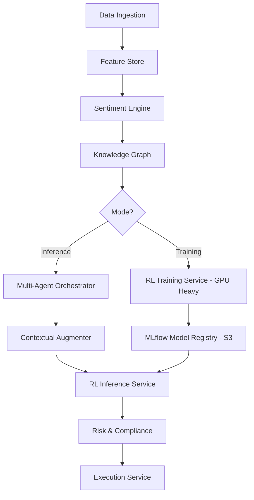

# NIFTY-RL Alpha Engine - Technical Documentation
**Version:** 1.0.0 | **Date:** 2026-10-02 | **Market:** NSE India - Nifty 50
**Author:** RL + Capital Markets Team | **Location:** Kochi, India (ap-south-1)

---

## Table of Contents
1. [Executive Summary](#1-executive-summary)
2. [System Overview](#2-system-overview)
3. [Architecture Diagrams](#3-architecture-diagrams)
4. [Microservices Design - Spin Up On Demand](#4-microservices-design)
5. [Backend - Training Pipeline](#5-backend-training-pipeline)
6. [Backend - Deployment & Inference Pipeline](#6-backend-deployment--inference-pipeline)
7. [Frontend Design](#7-frontend-design)
8. [Data Layer & Storage](#8-data-layer--storage)
9. [Data Scraping & Legal Compliance - Best Practices](#9-data-scraping--legal-compliance)
10. [Orchestration, Scaling & Deployment](#10-orchestration-scaling--deployment)
11. [Security, Risk & Compliance](#11-security-risk--compliance)
12. [Observability & MLOps](#12-observability--mlops)
13. [API Contracts](#13-api-contracts)

---

## 1. Executive Summary
NIFTY-RL is an Agentic Contextual RL system that provides BUY/SELL/HOLD + deep sentiment for each Nifty 50 stock. It differs from vanilla quant by using 7 LLM reasoning agents that actively pull relevant data (geopolitical, macro, flows) and fuse it into RL state via Knowledge Graph.

**Core Innovation:** RL does not just learn price patterns. It learns `π(a | s_price, c_t)` where `c_t` is dynamically retrieved context.

**Tech Stack:** Python 3.11, FastAPI, React + TypeScript, LangGraph, Stable-Baselines3/FinRL, PyTorch, Kubernetes (EKS), Kafka, TimescaleDB, Neo4j, Qdrant, Redis, S3.

---

## 2. System Overview

### Goals
- **Latency:** Inference < 100ms per stock, reasoning agents < 15s
- **Availability:** 99.9% during market hours 9:15-15:30 IST
- **Compliance:** SEBI algo tagging, audit trail, no unlicensed NSE data scraping
- **Cost:** Scale to zero after market. No GPU burn at night.

### High-Level Flow
`External Data -> Data Ingestion Service (Kafka) -> Feature Store -> Sentiment Engine + Knowledge Graph -> Multi-Agent Orchestrator -> Contextual State Augmenter -> RL Inference -> Risk Service -> Execution Service -> NSE via Broker API`

---

## 3. Architecture Diagrams

### 3.1 Microservices Architecture
[Microservices Architecture](/mnt/data/resource/image_20261002_233650.webp)

### 3.2 Mermaid - Data Flow for Training vs Inference


---

## 4. Microservices Design

All services are containerized, stateless, and scale via KEDA (Kubernetes Event-Driven Autoscaling). **Spin up when needed** principle: No service runs 24/7 except API Gateway and Kafka.

| Service | When It Spins Up | Trigger | Compute | Tech |
|---|---|---|---|---|
| **API Gateway** | Always on (2 replicas) | Ingress | 0.5 vCPU | Kong / AWS API GW |
| **Frontend Service** | Always on | User request | 0.5 vCPU | React, Vite, Next.js |
| **Data Ingestion Service** | 8:45 IST - 16:00 IST | Cron + Kafka lag | 1-4 vCPU | Python, Faust, CCXT |
| **Sentiment Engine** | On news event / 5 min cron | Kafka topic `news.raw` | 1 GPU (T4) autoscaled 0-3 | FastAPI + FinBERT + Llama 3.1 8B |
| **Knowledge Graph Service** | On demand, 5 min | gRPC call | 0.5 vCPU | FastAPI + Neo4j Driver |
| **Multi-Agent Orchestrator** | When RL entropy > 0.8 or event intensity > 0.7 | Kafka `reasoning.trigger` | 1 vCPU + LLM calls | LangGraph, CrewAI |
| **Feature Store Service** | Always low (1 replica) scales on read QPS | Feast | 1 vCPU, Redis | Feast + Redis |
| **RL Training Service** | Nightly 18:00-06:00 or on-demand | Manual / Airflow DAG | 4x A100, 32 vCPU | Ray + SB3 + MLflow |
| **RL Inference Service** | 9:00-15:45 IST | Kafka `features.enriched` | 1-10 vCPU, 0-2 GPU | FastAPI + ONNX Runtime |
| **Risk & Compliance** | Always during market | Every inference | 0.5 vCPU | FastAPI + OPA |
| **Execution Service** | On valid signal | Kafka `signals.validated` | 0.5 vCPU | Python + Zerodha Kite SDK |

**Scale to Zero Logic:**
```yaml
# KEDA ScaledObject for Sentiment Engine
apiVersion: keda.sh/v1alpha1
kind: ScaledObject
metadata:
  name: sentiment-engine
spec:
  scaleTargetRef:
    name: sentiment-engine-deployment
  minReplicaCount: 0
  maxReplicaCount: 5
  triggers:
  - type: kafka
    metadata:
      topic: news.raw
      lagThreshold: "10"
      bootstrapServers: kafka:9092
  - type: cron
    metadata:
      timezone: Asia/Kolkata
      start: 0 9 * * 1-5
      end: 30 15 * * 1-5
      desiredReplicas: "1"
```

---

## 5. Backend - Training Pipeline

### 5.1 Training Flow
1.  **Data Prep Job (Airflow DAG - 18:00 IST):** Pulls 10 years 1-min OHLCV from S3 Parquet, joins with FII/DII, corporate actions. Uses **Purged Split** to avoid leakage.
2.  **Feature Build (Feature Store):** Generates 180-dim state. Stores in TimescaleDB hypertable + Redis for low latency. Versioned via Feast.
3.  **Sentiment Labeling:** Batch inference over last day news -> sentiment_score, event_type. Stored in Qdrant.
4.  **World Model Training (Optional):** Train DreamerV3 latent dynamics model `p(s_{t+1} | s_t, a_t)` on historical data. Used for synthetic crash generation.
5.  **RL Training:** Ray cluster with 50 stock specialists (PPO + LSTM policy). Reward = Differential Sharpe - costs - drawdown penalty.
    - Offline pre-train: CQL (Conservative Q-Learning) to avoid overestimation.
    - Online fine-tune: Last 3 months with small LR.
6.  **Evaluation:** Walk-forward with embargo. Metrics: Deflated Sharpe, Calmar, MaxDD, Turnover. Must pass stress test: 2020 crash, 2024 election.
7.  **Registry:** Model + ONNX export + model card pushed to MLflow + S3 `s3://nifty-rl/models/v{version}/`.

### 5.2 Training Service API
`POST /train` { stocks: [RELIANCE, ...], regime: bear, use_world_model: true } -> returns training_id
`GET /train/{id}/logs` streams via WebSocket.

---

## 6. Backend - Deployment & Inference Pipeline

### Real-Time (Market Hours)
1.  Ingestion Service subscribes to **licensed** market feed (TrueData/GFDL, not direct NSE scrape). Publishes to Kafka `market.ticks`.
2.  Feature Store Service consumes, computes rolling z-score, publishes `features.enriched`.
3.  Multi-Agent Orchestrator watches RL entropy. If entropy > 0.8, triggers reasoning agents (Geopolitical pulls GDELT, Macro pulls RBI).
4.  Knowledge Graph Service traverses: `Crude +5% -> ONGC, RELIANCE, ASIANPAINT`. Returns affected list.
5.  Contextual Augmenter fuses price + context via cross-attention.
6.  RL Inference Service: ONNX model inference -> raw signal.
7.  Risk Service: Checks circuit limit, F&O ban, position limit, SEBI algo tag, kill-switch. If pass -> `signals.validated`.
8.  Execution Service: Smart order routing via Zerodha/Upstox. Logs to immutable audit log.

**Latency Budget:** Ingestion 20ms + Feature 10ms + Reasoning (async, not blocking) + Inference 30ms + Risk 10ms = <100ms for price-only path, <5s for reasoning-augmented path.

---

## 7. Frontend Design

### Tech: React 18 + TypeScript + Tailwind + Zustand + WebSocket + TradingView Lightweight Charts

#### A. Training Console (`/train`)
- **Purpose:** For quants to launch training.
- **Components:**
  - `Dataset Selector`: Date range, stocks, feature version
  - `Agent Config`: PPO hyperparams, reward weights, use world model toggle
  - `Live Logs`: Ray Train logs streamed via WS
  - `Evaluation Panel`: Equity curve, drawdown, Deflated Sharpe, feature importance SHAP, regime performance
  - `Model Comparison`: Side-by-side v1 vs v2

#### B. Deployment Console (`/deploy`)
- **Live Signals Table:** For each Nifty 50: Symbol, Signal BUY/SELL/HOLD, Confidence, Size, Sentiment Score, Top Drivers (chips), Reasoning Trace (expandable Bull vs Bear debate transcript)
- **Context Graph Visualizer:** Interactive Neo4j visualization: Click RELIANCE -> see it depends on Crude, USDINR, Jio.
- **Risk Dashboard:** Portfolio beta, sector exposure, F&O ban list, kill-switch button (big red)
- **Agent Monitor:** 7 agents health, last triggered, reputation score, cost spent on LLM calls today
- **What-If Simulator:** Slider "Crude $120" -> instant portfolio impact

#### C. Monitoring (`/ops`)
Grafana embedded: Kafka lag, GPU util, inference p99, agent latency, slippage, fill rate.

---

## 8. Data Layer & Storage

| Store | Purpose | Schema Example |
|---|---|---|
| **Kafka** | Event bus | Topics: `market.ticks`, `news.raw`, `features.enriched`, `signals.validated` |
| **TimescaleDB** | Time-series OHLCV, features | Hypertable: time, symbol, open, high, low, close, volume, delivery_pct |
| **Redis** | Low-latency feature cache | Key: `feat:RELIANCE:1m` -> 180-dim vector |
| **Neo4j** | Knowledge Graph | Nodes: Stock, Sector, Commodity, Event. Edges: DEPENDS_ON, AFFECTED_BY |
| **Qdrant** | Vector DB for RAG | Embedding 768-d FinBERT, payload: news text, source, timestamp, credibility |
| **S3** | Lake + Model Registry | `s3://nifty-rl/raw/`, `/features/`, `/models/`, `/audit/` immutable |
| **Postgres** | App DB | Users, training jobs, audit logs |

---

## 9. Data Scraping & Legal Compliance

### 9.1 Core Legal Principle for India
**DO NOT SCRAPE NSEINDIA.COM DIRECTLY FOR MARKET DATA.** NSE Terms explicitly prohibit commercial redistribution of real-time data without license. Violation = IP block + legal notice under IT Act 2000.

### 9.2 Compliant Data Strategy
**Tier 1 - Licensed (Must Pay):**
- **Market Data:** Subscribe to NSE Authorized Data Vendors: TrueData, Global Datafeeds, InvestingNote. Cost ~₹2000-5000/mo. They have redistribution license. Use their official WebSocket SDK, not scraping.
- **Fundamentals:** Use BSE Corporate Announcements API (official), Screener.in with permission (check ToS, rate limit 5 req/sec, cache), or licensed vendor like Refinitiv.

**Tier 2 - Public & Scrapable with Best Practices:**
- **News:** Use official RSS feeds (ET, Moneycontrol provide RSS). For scraping sites, MUST follow:
  1.  Check `robots.txt` (e.g., `https://economictimes.indiatimes.com/robots.txt`) - respect Disallow.
  2.  Identify via User-Agent: `NiftyRL-Bot/1.0 (+https://yourdomain.com/contact; purpose=research)`
  3.  Rate limit: Max 1 req/sec per domain, random jitter, backoff on 429.
  4.  Cache aggressively (Redis 15 min), don't hit same URL twice.
  5.  Store only facts/entities, not full copyrighted article text. Store headline + summary + link (fair dealing under Indian Copyright Act Sec 52 for research).
  6.  Attribution: Always show source link in frontend.

- **Government Data:** RBI, NSDL FII/DII, GDELT, IMD weather - these are public, free to use, but still rate limit.

**Tier 3 - Prohibited:**
- No login bypass, no CAPTCHA bypass, no paywall bypass (ET Prime).
- No insider info from Telegram "paid tips" groups.
- No personal data (DPDP Act 2023). Don't store user PAN, Aadhaar.

### 9.3 Technical Implementation for Legal Scraping
```python
# scraper base class
class CompliantScraper:
    def __init__(self, domain):
        self.domain = domain
        self.robots = RobotFileParser()
        self.robots.set_url(f"https://{domain}/robots.txt")
        self.robots.read()
    
    def can_fetch(self, url):
        return self.robots.can_fetch("NiftyRL-Bot/1.0", url)
    
    async def fetch(self, url):
        if not self.can_fetch(url):
            raise PermissionError(f"Blocked by robots.txt: {url}")
        await asyncio.sleep(1 + random.uniform(0,1)) # rate limit
        headers = {"User-Agent": "NiftyRL-Bot/1.0 (+https://nifty-rl.com/legal)"}
        # ... fetch with retry, respect 429 Retry-After
```

### 9.4 Legal Checklist
- [ ] NSE data vendor agreement signed
- [ ] SEBI Algo Trading - tagging with algo ID, approval from broker (Zerodha requires NSE algo approval for fully automated)
- [ ] Audit log immutable (S3 Object Lock) for 7 years as per SEBI
- [ ] DPDP Act: User data encrypted at rest, consent for data collection, data deletion endpoint
- [ ] IT Act: No defamation via sentiment engine, add disclaimer: "Not financial advice"
- [ ] Logging: Every automated order tagged with unique ID for NSE surveillance

---

## 10. Orchestration, Scaling & Deployment

### Infrastructure: AWS ap-south-1 (Mumbai) for <20ms to NSE

- **Kubernetes (EKS):** 1 cluster, 3 node groups: `general (m6i.large)`, `gpu (g5.xlarge - T4)`, `memory (r6i.large for Redis/Neo4j)`
- **KEDA:** Event-driven autoscaling from 0. Training service scales 0 at day, 4xA100 at night.
- **Helm Charts:** One chart per microservice, with `values-prod.yaml` for IST market hours.
- **CI/CD:** GitHub Actions -> Build Docker -> Push ECR -> ArgoCD deploys to EKS. Training models promoted via MLflow model registry stages: Staging -> Production (requires manual approval).
- **Cost Optimization:** Spot instances for training, Karpenter for node autoscaling, S3 Intelligent Tiering, turn off GPU node group 16:00-08:00 IST via Lambda.

### Spin Up Logic Summary
| Event | Action |
|---|---|
| 08:45 IST cron | Scale Ingestion, Feature, Inference, Risk to 1 |
| Kafka lag >10 on `news.raw` | Scale Sentiment Engine 0->3 |
| RL entropy >0.8 | Scale Orchestrator 0->2 |
| 15:45 IST cron | Scale all inference services 1->0 |
| Airflow DAG 18:00 | Scale Training to 4xA100 |

---

## 11. Security, Risk & Compliance
- **Auth:** OAuth2 + JWT, RBAC (quant, trader, admin)
- **Secrets:** AWS Secrets Manager for Kite API keys, DB creds
- **Network:** Service mesh Istio, mTLS between microservices, WAF on API GW
- **Risk Kill-Switch:** Big red button calls `POST /risk/kill` -> sets Redis flag `kill_switch=1` -> Execution Service rejects all orders. Must be manual + auto (if Nifty falls >5% or MaxDD >15%)
- **Data Encryption:** TLS 1.3 in transit, AES-256 at rest (S3 SSE, RDS encryption)

---

## 12. Observability & MLOps
- **Metrics:** Prometheus + Grafana: inference latency p99, GPU util, Kafka lag, slippage, fill rate
- **Logs:** Loki + ELK, JSON structured logs with trace_id
- **Tracing:** OpenTelemetry across microservices
- **Model Monitoring:** Evidently AI for data drift (feature distribution shift), concept drift (Sharpe decay). Alert if live Sharpe deviates >2 sigma from backtest.
- **Experiment Tracking:** MLflow + W&B for training runs

---

## 13. API Contracts (Key)

```yaml
# POST /api/v1/signals - Inference
Request: { symbols: ["RELIANCE", "TCS"] }
Response: {
  signals: [
    { symbol: "RELIANCE", signal: "BUY", confidence: 0.81, size_pct: 6.5,
      sentiment: { score: 0.62, drivers: ["Jio ARPU beat"], source_links: ["..."] },
      reasoning_trace: { bull: "...", bear: "...", winner: "bull" },
      risk_check: "PASS",
      timestamp: "2026-10-02T14:30:00+05:30"
    }
  ]
}

# POST /api/v1/train
Request: { stocks: ["NIFTY50"], start_date: "2014-01-01", reward: "diff_sharpe", use_world_model: true }
Response: { training_id: "train_abc123", status: "QUEUED" }
```

---

## Appendix: How to Run Locally
```bash
docker-compose up -d kafka redis timescaledb neo4j qdrant
helm install nifty-rl ./charts --values values-dev.yaml
kubectl port-forward svc/frontend 3000:80
# Frontend: http://localhost:3000
# API Docs: http://localhost:8000/docs
```

**Disclaimer:** This system is for educational/research purpose. Trading involves risk. Ensure NSE authorized data vendor license and broker algo approval before live deployment. Not financial advice.


# Local Testing Framework - Test Everything Before Cloud

**Goal:** Run 100% of NIFTY-RL stack on a laptop (16GB RAM, no GPU) using Docker Compose + kind (K8s in Docker). Zero cloud cost, zero SEBI risk.

## 1. One-Command Local Stack

```bash
# Prereqs: Docker Desktop, kind, kubectl, helm, python 3.11
make local-up
# Does:
# 1. kind create cluster --config kind-config.yaml
# 2. docker-compose -f docker-compose.local.yaml up -d kafka redis timescaledb neo4j qdrant minio localstack wiremock
# 3. helm install keda kedacore/keda --namespace keda
# 4. tilt up (hot-reload microservices)
```

**docker-compose.local.yaml**
```yaml
services:
  kafka: { image: bitnami/kafka:3.6, ports: ["9092:9092"] }
  redis: { image: redis:7-alpine }
  timescaledb: { image: timescale/timescaledb:2.14-pg15 }
  neo4j: { image: neo4j:5-community, environment: [NEO4J_AUTH=neo4j/test123] }
  qdrant: { image: qdrant/qdrant:v1.8 }
  minio: { image: minio/minio, command: server /data } # S3 mock
  localstack: { image: localstack/localstack } # AWS mock
  zerodha-mock: { image: wiremock/wiremock, volumes: ["./mocks/zerodha:/home/wiremock/mappings"] }
```

## 2. Testing Pyramid

| Level | Tool | Tests | Command |
|---|---|---|---|
| Unit | pytest, jest | Single function | pytest services/ingestion/tests/test_parser.py |
| Contract | Pact | API schema | pact-verifier --provider=feature-store |
| Integration | Testcontainers | Service+DB | pytest -k integration --with-containers |
| Component | Compose | One service + deps | docker-compose run ingestion pytest |
| E2E | Playwright+Kafka | Tick->Signal->Order | pytest tests/e2e/test_tick_to_signal.py |
| Perf | Locust/k6 | Latency p99 <100ms | locust -f tests/perf/locustfile.py |
| Chaos | Chaos Mesh | Kill agent, lag | chaos run kill-sentiment-agent.yaml |
| Compliance | OPA Conftest | robots.txt, audit | conftest test --policy legal/ |

## 3. Per-Service Local Tests

### A. Data Ingestion Service
- Mock: tests/mocks/nse_ticks.json
- Unit: parser handles bonus/split: TCS bonus 1:1 -> 3500 to 1750
- Integration: Testcontainers Kafka - publish tick, assert consumer gets it in 5s
- Legal: test_respects_robots_txt() - must return False for disallowed path, test rate limiter (2 req/sec -> backoff)
- Coverage: --cov-fail-under=80

### B. Sentiment Engine
- Use ollama llama3.1:8b or FakeLLM for local
- Unit: sentiment("Q2 profit beat") >0.5
- E2E: publish to news.raw -> Qdrant has embedding in 10s
- Hallucination: feed "RELIANCE buys Google for $1" -> checker flags credibility <0.3

### C. Knowledge Graph
- Seed: CREATE (ONGC)-[:DEPENDS_ON]->(Crude)
- Unit: get_dependencies("ONGC") == ["Crude"]
- Perf: MATCH (s)-[*1..3]->(e) WHERE e.severity>0.8 <50ms

### D. Multi-Agent Orchestrator
```python
def test_geopolitical_triggers_on_entropy():
    orchestrator = Orchestrator(llm=FakeLLM(["Crude up Iran"]))
    result = orchestrator.run(stock="ONGC", entropy=0.9)
    assert "GDELT" in result.tools_called
    assert result.context["geopolitical_risk"] >0.7
```
- Debate test: Bull vs Bear 3 rounds, judge picks winner

### E. Feature Store
- Unit: zscore([1,2,3]) normalized
- Integration: Feast materialize TimescaleDB->Redis <10ms read
- Data Quality: Great Expectations - RSI 0-100, no future timestamps

### F. RL Training (cheap local)
- Use 1 month, 2 stocks, 100 episodes, CPU only
- Reward includes cost: pnl=100 cost=11 drawdown=5 -> <100
- Deterministic: set_seed(42) twice -> same weights
- World Model MSE <0.01

### G. RL Inference
- ONNX parity: PyTorch vs ONNX diff <1e-5
- Locust: 50 users, p99 <100ms

### H. Risk & Compliance (100% coverage)
```python
def test_circuit_filter(): assert risk.check("RELIANCE", price=2990, circuit=3000) == "REJECT"
def test_fno_ban(): redis.set("fno_ban","ADANIENT"); assert risk.check("ADANIENT") == "REJECT"
def test_kill_switch(): redis.set("kill_switch",1); assert risk.check("ANY") == "REJECT"
def test_audit_immutable(): log_order("123"); s3.delete should raise error (Object Lock)
```

### I. Execution (never real broker)
- WireMock for Zerodha: POST /orders/regular -> 200 mock_123
- Unit: iceberg slicing 1000 -> 10x100
- Integration: signals.validated -> WireMock got call in 5s

### J. Frontend
- Jest + React Testing Library, Playwright
- WS test: mock signal -> table updates <1s
- Kill-switch button -> POST /risk/kill -> red banner

## 4. Spin-Up Logic Testing (KEDA 0->1)

```bash
helm install keda kedacore/keda --namespace keda
kubectl apply -f k8s/keda/sentiment-engine-scaledobject.yaml # minReplicaCount:0
kafka-producer --topic news.raw --messages 15
kubectl get hpa -w # should 0->1 in 30s
# Cron test: 09:00 IST Asia/Kolkata should scale to 1
```

KEDA ScaledObject example:
```yaml
minReplicaCount: 0
maxReplicaCount: 5
triggers:
- type: kafka
  metadata: { topic: news.raw, lagThreshold: "10", bootstrapServers: kafka:9092 }
- type: cron
  metadata: { timezone: Asia/Kolkata, start: 0 9 * * 1-5, end: 30 15 * * 1-5, desiredReplicas: "1" }
```

## 5. Full E2E: Tick -> Mock Order

```bash
make e2e-local
# 1. docker-compose.local up -d
# 2. seed TimescaleDB 1 day Nifty + Neo4j graph
# 3. publish 100 mock ticks + 2 news "Crude up 5% Iran"
# 4. wait: Feature -> Orchestrator -> Inference -> Risk -> Execution
# 5. assert: WireMock order, Qdrant 2 embeddings, MinIO audit 1 entry, Frontend WS signal
# 6. chaos: kill sentiment-engine pod, assert degraded price-only signal still works
```

Expected:
```
E2E PASS: 100 ticks -> 12 signals -> 8 passed risk -> 8 mock orders
Latency p99: 87ms PASS
Audit immutable: PASS
Legal robots.txt: PASS
Cost: $0
```

## 6. CI Before Cloud

.github/workflows/local-test.yaml:
- kind create cluster
- make local-up && make e2e-local && make perf-test && make compliance-test
- trivy image scan
- Only if passes, ArgoCD deploys to EKS prod

## 7. Makefile

```makefile
local-up: kind create cluster; docker-compose -f docker-compose.local.yaml up -d; tilt up
local-down: kind delete cluster; docker-compose down -v
test-unit: pytest services/*/tests/test_*.py --cov
test-integration: pytest -k integration --with-containers
e2e-local: pytest tests/e2e/test_tick_to_signal.py -s
perf-test: locust -f tests/perf/locustfile.py --headless --run-time 2m --check p99<100
compliance-test: conftest test --policy policies/legal/; python tests/legal/test_robots.py
chaos-test: kubectl apply -f chaos/kill-agent.yaml; pytest tests/chaos/test_degraded_mode.py
```

Golden Rule: If it doesn't pass `make e2e-local` on laptop, it never goes to cloud. Saves ~15k INR/month GPU and prevents SEBI issues.
