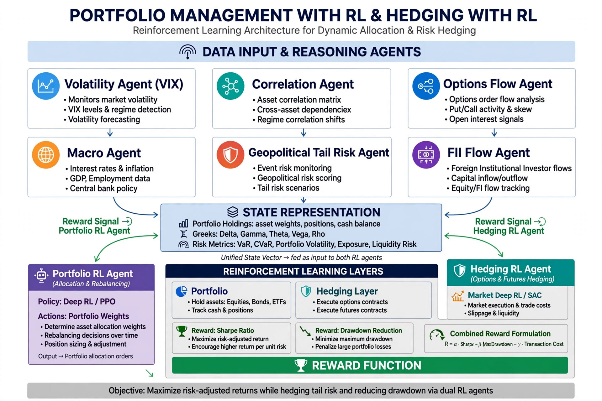

# Portfolio Management + Hedging with RL - Extension

This extends [NIFTY-RL-Technical-Doc.md](NIFTY-RL-Technical-Doc.md) with
portfolio sizing and hedging layers on top of stock-level signals.

> **Revision 1.1 — corrected against the research corpus.**
>
> Version 1.0 of this document proposed a dual-RL allocator whose two
> specified components **cannot be built as written**, whose reward
> function is the textbook setup for a documented pathology, and whose
> headline evidence base — multi-agent LLM agents pulling context — has
> since been measured to lose to buy-and-hold at **p <= 0.006**.
>
> Claims have been corrected or removed, and each removal is stated
> inline. The canonical record of what was wrong is
> **[research/corrections-to-design-docs.md](research/corrections-to-design-docs.md)**.

**The headline finding, and it governs this whole document:**

> **Do not build a pure RL portfolio allocator, and do not build a
> learned hedger, as the primary strategy.** Not one properly-controlled
> study shows RL winning on average. On Nifty-50 specifically, **HRP beat
> all four DRL agents on average** (Sahu & Bhandari 2026), and
> **linear regressions on Black-Scholes Greeks beat BS delta hedging by
> 15-20% MSHE while neural networks added nothing** (Ruf & Wang,
> *JBES* 40(4), 2022).
>
> The defensible version of this work is narrow: **RL is a drawdown and
> risk controller, not an alpha engine** — and only as an overlay on a
> robust optimizer.

---

## 1. Architecture



*Version 1.0 diagram, retained for the record. It shows the two services
that version 1.0 proposed adding. Both are withdrawn — see
[section 5](#5-what-was-removed-and-why) and
[4.5](#45-what-to-build-instead).*

### What version 1.0 proposed

```
Stock signals (BUY/SELL) -> Portfolio RL agent (weights across 50)
  -> Hedging RL agent (Nifty futures/options) -> Final orders
```

with both agents trained jointly as multi-agent RL under CTDE.

### What is actually recommended

```
1/N or EW-vol allocator (HRP if you must be clever)
   + volatility targeting with a hard turnover band
   + futures hedge sized from a rolling 60-day beta estimate
   + a rule-based, VIX-conditional put-spread overlay
   + RL, later and optionally, for execution and rebalancing timing only
```

Note what is absent: **no learned weights, no per-decision LLM
context, no debate.** Each removal has a measurement behind it and is
documented below.

---

## 2. Why classical approaches fail on NSE

Version 1.0's three arguments are **correct and retained**:

- **Markowitz assumes static correlation.** In India correlation goes
  toward 1 in a crash (March 2020, all 50 fell). Correct.
- **Black-Scholes delta hedging assumes continuous rebalancing at zero
  cost.** With STT, gaps and liquidity, that assumption is expensive.
  Correct.
- **A fixed 50% Nifty future short loses in a bull market.** Correct.

### What follows, and version 1.0 got it backwards

Each of those arguments is an argument *for a hedged, cost-aware,
low-turnover book*. It is **not** an argument for a learned policy.

- Michaud (1989) named the failure mode: MVO is **error maximization**.
  Watch MVO-MaxSharpe on the least-efficient Nifty cluster — 41.9%
  annualised return, 48.2% vol, **-36.8% max drawdown**.
- DeMiguel (2009): *"none is consistently better than the 1/N rule in
  terms of Sharpe ratio, certainty-equivalent return, or turnover."*
  The estimation window needed for sample-MVO to beat 1/N is **~3,000
  months for 25 assets and ~6,000 for 50** — 250 to 500 years.
- The one DRL agent that beat the best classical benchmark did so by
  **+0.16 Sharpe in one of three regimes, and was negative in the other
  two.** Seed noise on RL Sharpe alone is **+/- 0.19**. **The claimed
  effect is smaller than the noise in the estimate.**

So the correction to version 1.0 is not "use a different algorithm". It
is **use the baseline as the default and be suspicious of anything that
beats it**.

---

## 3. Portfolio Management Layer

### 3.1 What version 1.0 specified, and what survives

| Version 1.0 element | Disposition |
|---|---|
| Max 10% per stock, max 30% per sector, turnover < 5x | **Kept.** Correct, and cheap to enforce in the environment |
| 250-dim state: holdings, market, risk | **Reduced.** See [3.2](#32-the-state-vector-is-smaller-than-specified) |
| Continuous target weights on the simplex | **Kept as the action *shape***, but see [3.3](#33-constraints-and-projection) |
| SAC or DDPG | **Withdrawn as the allocator.** See [3.5](#35-the-algorithm-question) |
| "RL learns dynamic correlation from a Correlation Agent" | **Withdrawn.** See [3.4](#34-the-agents-are-withdrawn) |
| Differential Sharpe reward with sector penalty | **Rewritten.** See [3.6](#36-reward-reality-checks) |

### 3.2 The state vector is smaller than specified

**Removed: FII/DII as a per-stock feature.** The NSE FII/DII aggregate
is **one India-wide number**. Across a 50-name cross-section it
contributes ~50 duplicate values. It is a regime indicator, not a
feature, and belongs in a single global state variable.

**Removed: PCR and open interest.** No cited paper in the deep hedging
literature uses put-call ratio or OI as a state variable. OI is also a
poor real-time proxy — published once per settlement cycle, contaminated
by the previous expiry's expiry-day activity, and in Nifty dominated by
a handful of institutional strikes. It adds state dimension and
measurement noise for no evidenced return.

**Kept:** portfolio weights, unrealised PnL, cash, time since rebalance,
sector exposure, rolling volatility, India VIX, and a risk block (VaR,
beta, drawdown).

### 3.3 Constraints and projection

> **CORRECTED.** Version 1.0 wrote: *"project to constraints via
> cvxpy"* and *"Use cvxpy layer in policy to enforce sector limit."*

**A QP projection is not differentiable.** You cannot backprop through
cvxpy, so the policy gradient is **silently wrong**. This is not a
performance issue; it trains, it converges, and it optimises the wrong
objective.

**What replaces it:**

1. **Hard feasibility outside the policy.** Project onto the simplex as
   post-processing in the environment, so the executed trade is always
   feasible, and treat the pre-projection action as unconstrained.
2. **Soft constraints in the reward** — sector concentration, turnover.
3. **A hard turnover band in the environment**, because at 22 bps round
   trip that constraint is not negotiable. One-way turnover of 100%/month
   costs **~2.7%/yr** at 15% vol, which is ~0.18 Sharpe units — most of
   the published RL "alpha".
4. If the constraint genuinely must be in the gradient, the primitives
   are **OptNet**, **cvxpylayers**, or **DFWLayer** (Frank-Wolfe, which
   is the most directly relevant for simplex constraints). Note there is
   essentially **no finance literature using these inside an RL policy** —
   the field is still on softmax, which is itself evidence about
   maturity.

Version 1.0's own line *"Constraints enforced via action masking: if
sector > 30%, penalize"* mixes two things. Masking is for hard rules; a
penalty is soft and tradeable against reward. Keep them distinct.

### 3.4 The agents are withdrawn

Version 1.0 proposed six per-portfolio agents: Correlation, Volatility,
FII Flow, Macro, Sector Dependency, Geopolitical Tail Risk. Plus an
"Options Flow Agent" in the hedge state.

**FII Flow Agent — withdrawn.** FII/DII is one global number; a
per-stock pull is structurally incoherent.

**Options Flow Agent (PCR, OI) — withdrawn from the state.** No cited
paper uses it, and OI is a bad real-time proxy.

**Correlation Agent (30d correlation matrix, HMM, GDELT) — reduced to
one scalar.** A 50x50 matrix plus an HMM regime label is enormous state
for a decision that reduces to "are correlations high".

**Volatility Agent — reduced to one scalar.** India VIX is a free daily
number. It does not need an agent to fetch it.

**Macro Agent — reduced to features.** USD/INR and the US 10Y are price
series. Compute them; do not call an LLM.

**Sector Dependency Agent — withdrawn.** ~300 static edges in a CSV
beats a graph service.

**Geopolitical Tail Risk Agent — withdrawn.** Part of the multi-agent
LLM layer; see [3.7](#37-the-context-fusion-claim).

The pattern: **every one of these is a feature that can be computed.**
The agents add a language model to do arithmetic.

### 3.5 The algorithm question

The evidence on the specific algorithms version 1.0 named:

| Finding | Number |
|---|---|
| **Equal weight beat SAC** on Nifty-50 | EW **1.079** vs SAC **1.062**; EW also beat buy-and-hold at 1.065 |
| **HRP beat all four DRL agents** | HRP **1.395**; best DRL agent DDPG 1.288 |
| **SAC had the worst PBO of three algorithms** | **21.3%** over a 2,700-combination grid |
| **Standard walk-forward + PPO carries ~17.5% PBO** | The industry-standard procedure is itself overfitted |
| **SAC is destabilised by low-SNR markets** | *"bootstrapping amplifies these errors"* — its Q-values are mostly noise |
| **Empirical ranking** | A2C > PPO > DDPG >> SAC |
| **Seed variance on RL Sharpe** | mean 0.604, **SD 0.193**. Best-seed reporting inflates Sharpe by **44%** |

**SAC specifically has a named failure mode in markets.** Its entropy
bonus, twin critics and off-policy bootstrapping work in high-SNR
control problems and degrade in low-SNR markets. On Nifty-50 it was the
*worst* DRL agent and had the *worst* PBO.

**And the RL leaderboard is an artifact of the cost model you chose.**
Riera Abbade (2026) showed realistic costs change *"both absolute
performance **and the relative ranking of algorithms**"* across three
environments. Your Indian stack is 22 bps, not 0.

**CPO is not recommended.** It is essentially unused in finance, its
demonstrated domain is MuJoCo locomotion, and it needs a differentiable
cost estimate you do not have — you get a safety guarantee on a
simulator.

### 3.6 Reward reality checks

Version 1.0's reward:

```
r_t = alpha * differential_sharpe - beta * turnover_cost
      - gamma * sector_concentration_penalty - delta * max_drawdown
```

Two of those four terms are problematic.

**A max-drawdown penalty is actively dangerous, and it is the exact
pathology documented in the hedging literature.** The failure mode is the
**doubling strategy**: an asymmetric reward that penalises losses but not
gains lets the agent profit by *increasing* exposure after losses,
because the expected recovery gain from a bigger position can exceed the
incremental penalty. That is a martingale.

François et al. had to add penalties *"to ensure that the RL agent learns
a true hedging strategy rather than engaging in speculative behavior"*,
warning about *"doubling strategies, where agents continuously increase
their exposure in an attempt to recover successive losses."*

Three specific problems with drawdown as a per-step reward:

1. **Drawdown is non-time-separable.** It is a functional of the whole
   path, not additive over steps. Every paper uses a proxy, and the
   proxies are asymmetric — which is the doubling pathology.
2. **It under-penalises gains asymmetrically.** Zernikov's default
   reward reduces to a form **completely flat for non-negative daily
   P&L**, and the agent learned a **systematic underhedge**.
3. **It rewards "never being down" over "recovering well."** Under a
   drawdown-only reward there is no absolute capital-preservation
   incentive.

**If you must use a drawdown notion, make it a coherent expectation:**
expected maximum drawdown, or CDaR, and use it as a **constraint**, not
as the per-step reward.

**Never optimise "return subject to drawdown <= D" as a per-step
reward.** That is the textbook formulation of the pathology.

> **CORRECTED.** Version 1.0 also wrote
> `turnover_cost = 0.0011 * ||w_t+1 - w_t||_1`. The 0.0011 figure is
> right — one-way 11 bps against a 22.25 bps delivery round trip — but
> it was presented as a scalar rather than routed through the verified
> rate model in `src/stock_rl/costs.py`. **The cost must come from
> `CostModel`, not from a hand-typed constant.** See
> [7](#7-costs-verified).

### 3.7 The context fusion claim

Version 1.0's central claim was that fusing agent-pulled context into
the state via a cross-attention "Contextual Augmenter" would beat a
price-only state.

Two independent problems:

1. **The Augmenter is unspecified.** Nothing trains it, and the RL reward
   does not supervise attention weights. This was the claimed core
   innovation and it is a blank.
2. **The context may not carry information at all.** Buy-and-hold beats
   LLM agents **significantly across 63-91 unbiased symbols, p <= 0.006**
   (FINSABER, KDD 2026 Oral), with **no agent producing significant
   alpha (all p > 0.34)**. The original papers that reported gains
   evaluated on **3 stocks over 3 months**.
   And **Nifty-50 constituents are precisely the large, well-covered,
   institutional names where coverage dilution is worst.**

**The correct move is not a better fusion mechanism. It is the cheap
experiment.** See
[section 8](#8-what-to-do-instead-in-order).

---

## 4. Hedging with RL

### 4.1 Instruments

Version 1.0's list is **retained**: Nifty futures, Nifty options
(ATM/OTM puts, put spreads, collars), stock futures for single-name
hedge. Not exotics. Not weekly Bank Nifty against a Nifty-50 book
(basis risk).

**One correction to the sizing:** version 1.0's action space allowed a
future hedge of `-0.5` described as *"50% portfolio short via future"*.
Min-variance optimal hedge ratios for Nifty spot vs futures cluster
around **0.7-1.0**, and one 2022-2024 study reports MVHR **0.87** cutting
portfolio variance **63.4%** at **12.8%** annualised return, most
effective in bear markets. Under-hedging at 0.5 is a coverage decision,
not a constraint, and should be a parameter with a reason.

### 4.2 The action space as specified cannot work

> **CORRECTED.** Version 1.0 specified a **mixed Box + Discrete** action
> and then said *"Uses SAC with action masking."*

**SAC's squashed-Gaussian actor is continuous-only.** It is unimodal and
cannot represent a discrete choice over strikes and expiries. A mixed
`Box + Discrete` space needs separate heads with autoregressive
conditioning, or **the discrete choice must be removed from the policy
entirely.**

There is a second, deeper problem: **unimodality itself is wrong for
hedging.** Optimal hedging strategies may be multimodal under non-convex
risk landscapes, and terminal CVaR adds further non-convexity. A
Gaussian head can only average across modes, which in hedging means
*"half-short, half-long"* — **a nonsensical hedge.**

**How the literature actually handles it: they dodge it.** Mikkilä &
Kanniainen use a single instrument. François et al. hardcode one ATM
call at a fixed tenor; the action is a 2-D continuous vector. Zernikov
uses the underlying only, with Greeks deliberately excluded so the
policy learns its own delta correction. Where discrete actions do appear,
it is DQN variants, distributional RL, or a projection — `clip(., 0, 1)`.
**Hierarchical RL is essentially absent from deep hedging.**

**Three correct options:**

**Option A — reparameterise. Strongly preferred.** Replace "pick strike,
expiry, size" with "pick a **target coverage ratio** for each of 2-4
**predefined structures**". The action becomes 3 continuous Box
variables, which is **pure SAC-compatible**. Strike and expiry selection
becomes a **contract-design decision made by you**, revisited quarterly
— which is how it is done in practice. This also removes the exploding
action space: Nifty has ~10 expiries x ~40 strikes = 400 discrete
choices per step.

**Option B — autoregressive factorisation.**
`pi(a|s) = pi1(a_strike, a_expiry | s) * pi2(n | s, a_strike, a_expiry)`
— discrete categorical heads (Gumbel-Softmax straight-through, or
SAC-Discrete per-head log-prob) first, then a squashed-Gaussian
continuous head **conditioned on the sampled discrete output**, not just
its distribution. Correct, since size is state-dependent on what was
picked. More machinery.

**Option C — hard hierarchical two-stage.** High level (monthly) chooses
a structure; low level (daily) sizes within it. **Statistically hopeless
to learn properly** — 10 years of Nifty is ~120 monthly decisions. This
is why the literature doesn't do it.

### 4.3 State: the minimum viable set

> **CORRECTED.** Version 1.0's hedge state included an "Options Flow
> Agent" pulling PCR and OI build-up, and a full volatility surface with
> skew.

**Drop PCR and OI.** No cited paper uses them. OI is published once per
settlement cycle and is contaminated by the previous expiry's
expiry-day activity. See [3.2](#32-the-state-vector-is-smaller-than-specified).

**Do not fit a 2D surface.** Greeks are cheap derivatives of the same IV
and add roughly 5-10%. **Four numbers, backed by Ruf & Wang:**

1. Underlying level
2. BS delta of the liability at current IV
3. Time to expiry
4. Current hedge inventory

NSE reality: you can get a reliable ATM/near-money surface; deep wings
and OI history are the expensive part — and by Ruf & Wang **you do not
need them**.

### 4.4 Constraints: projection first

Version 1.0 wrote *"cannot buy puts if IV > 30% (too expensive) unless
tail risk > 0.9"* as an action mask. **That instinct was right.** SEBI
and NSE aside, it is a hard business rule, and a Lagrangian lets the
agent trade it off against reward.

Implement it as a **state-dependent admissible action set**, not a
penalty:

- For a discrete head: mask disallowed instruments (logits to -inf
  before softmax).
- For the continuous coverage form: clamp
  `coverage_upper(sigma) = min(A_max, k / sigma)` — cheap when IV is
  rich.
- **Apply the mask identically in the critic target computation.** A
  discontinuity in the actor's policy map makes the critic's Q-values
  for masked actions wrong, which is a real source of instability.
- If masking destabilises training, keep the mask and **normalise the
  reward by the feasible frontier** — put the constraint in the
  baseline, not the gradient.

**Bounded hedge ratio:** `n_t = N_max * tanh(g(s_t)) * m(s_t)`, and
**bound the turnover too.** Tiny policy perturbations (average delta MAE
0.006) change realised reward materially, so a rate limit is required.

### 4.5 What to build instead

**Honest disclosure: the Indian-specific published evidence is weak.**
No credible study of RL-based Nifty hedging exists.

**The ceiling on the gain.** Ruf & Wang: linear regressions on BS
Delta/Vega/Vanna/Gamma improve MSHE over BS delta by **15-20%** on real
data. **In none of the datasets do ANNs outperform the linear regression
models.** Net Sharpe effect of the full 15-20% MSHE improvement:
**x1.10 to x1.11.** The rule of thumb is **0.9 x delta for calls, 1.1 x
delta for puts** — no historical data required.

**What RL actually learns, in closed form.** Zernikov distilled the TD3
policies by symbolic regression. Mean correction **-0.055**, below BS
delta in **94.2% of states**; average complexity **9.6**; correlated
**+0.565 with moneyness, -0.346 with IV, -0.062 with maturity**. It is
a **moneyness-centred delta haircut, stronger in high-vol regions** —
which is exactly Hull & White (2017)'s minimum-variance delta, closed
form.

**And the distilled formula beat the neural agent**: reward +0.604 vs
the agent. **Adding complexity bought nothing.**

#### Tier 0 — weeks, not months. No learning.

1. Estimate portfolio **beta to Nifty** by rolling 60-day regression.
   That single number is the hedge ratio.
2. Base hedge: short Nifty futures at a **fixed fraction of beta**,
   starting **0.5-0.7**. Re-estimate monthly.
3. **Vol-scaled delta adjustment:**
   `hedge = delta_target * (1 - lambda * max(0, IV_rank - 0.8))`,
   `lambda` ~ 0.2-0.3. This *is* the distilled correction. Costs
   nothing, is auditable, and every rupee of P&L is attributable to it.
4. **VIX-conditional tail overlay:** a 1-2 quarter put spread, fixed
   schedule, 95-98% delta coverage, activated only when India VIX has
   been in its top decile for more than 5 days. Rule-based.
5. **Turnover limit** in the execution layer.

#### Tier 1 — the honest upgrade

A **Hull-White / Delta-Vega-Vanna regression** on your own Nifty data,
walk-forward, delta coefficient freely estimated. Three coefficients,
refit monthly, fully explainable. Per Ruf & Wang this captures the
entire measured gain.

#### Tier 2 — only with a reason

RL, restricted to **sizing within a fixed instrument set** (Option A
above), trained on **high-alpha CVaR or semi-RMSE**, with the
anti-doubling Lagrangian from the start, hard rules masked rather than
penalised, and **2022- and 2023-like periods held out as mandatory
validation**.

**If CVaR is used, alpha must be >= 85%.** Below alpha = 20% the
difference between a deep-hedging position and a delta position stops
being a hedge at all: François et al. measured the difference strategy
earning **+1.37 unconditionally — about 43% of the option's initial
price, every path** — with **R^2 = 0.003** against delta. **The agent has
abandoned hedging.** The risk measure is the whole ballgame.

**Design against Tier 0/1, not against Black-Scholes delta.** If you
benchmark only against delta you will conclude RL is transformative,
when a 10% delta haircut is most of it.

### 4.6 Regime behaviour you must backtest for

| Regime | What happens | What to do |
|---|---|---|
| **2020** violent crash, IV spike | **Deep hedging worked.** Downside variance improved significantly; the vol channel cushions the option leg | This is the case for any option overlay |
| **2022** grinding bear, weak vol cushion | **The real failure.** Reward **-1.905** at p<5%, in every random seed. A timing failure under the asymmetric objective | Hold this period out as mandatory validation |
| **2017, 2023** low vol | **Ordinary variance fails.** In 2023 BS left **0.45% uncancelled variance** — nothing left to remove; the agent's residual long spot adds dispersion | Report ordinary variance separately even if you don't train on it |

Across 45 frozen policy-year pairs: downside variance favourable in
**36/45**, significantly favourable in 13, **zero significantly
unfavourable**. Ordinary variance favourable in only **10/45**,
**significantly unfavourable in 17/45**.

> **The downside delta correction generalises across regimes. Ordinary
> variance does not, and will actively hurt you.** If the mandate is
> drawdown the asymmetry is defensible; if the risk report shows total
> variance, you will get flagged.

**Backtest 2015-2016, 2022, and 2023-like episodes** — not just 2020.

---

## 5. What was removed, and why

Consolidated index. Full evidence in
[research/corrections-to-design-docs.md](research/corrections-to-design-docs.md).

| Version 1.0 claim | Disposition |
|---|---|
| SAC with a mixed Box + Discrete action space | **Impossible as specified.** Option A in [4.2](#42-the-action-space-as-specified-cannot-work) |
| "Use cvxpy layer in policy to enforce sector limit" | **Not differentiable.** Policy gradient silently wrong |
| "Trained jointly (multi-agent RL / CTDE)" | **Withdrawn.** Two RL layers relearning the same book is not decomposition |
| "Online fine-tune" across phases | **Withdrawn.** Offline replay only |
| Max-drawdown term in the per-step reward | **Doubling-strategy pathology.** Coherent expectation or a constraint instead |
| PCR and OI in the hedging state | **Withdrawn.** No cited paper; poor real-time proxy |
| Six context agents, one per data type | **Withdrawn.** They are computable features |
| Per-signal multi-agent LLM context | **Withdrawn.** Buy-and-hold wins at p <= 0.006 |
| KEDA scaling for both new services | **Withdrawn.** Same mutually-exclusive-trigger defect, and the whole EKS premise is gone |
| "Hedged position margin benefit (NSE): long stock + short future = 60%" | **Marked UNVERIFIED.** No such figure appears in the research corpus. Do not encode it until sourced from the current NSE circular |
| "SEBI: hedge ratio < portfolio value" | **Marked UNVERIFIED.** No supporting instrument found. The hedge declaration and tagging duties are real; this specific ratio limit is not sourced |
| Section 10's worked example with invented P&L | **Withdrawn.** "Next day Nifty falls 2.5%, puts gain 180%" is presented as an expected result. It is a story, not an estimate |

### 5.1 What is genuinely required for hedging in India

| Requirement | Status |
|---|---|
| Every hedge order tagged with `hedge_for: portfolio_id, reason: <cause>` | **Keep.** An audit-trail field |
| Hedge orders tagged with the Algo ID, like every other order | **Hard requirement** |
| F&O ban check before any derivative order | **Hard requirement** |
| Hedges must be offered to the market — no cross trades | **NSE para 10.1** |
| No algo market orders in equity | **NSE/MSD/67753 §8.1.1.12** |
| Servers in India, no interlink outside | **2012 circular para 4(iii)** |

> **CORRECTED.** Version 1.0 wrote *"SEBI: hedging via Nifty
> futures/options is allowed for portfolio, but must be declared as hedge,
> not speculative."* The **declaration and tagging** duty is real and
> documented. The framing that this permits an unrestricted hedge ratio is
> **not sourced**. Treated as UNVERIFIED pending counsel.

---

## 6. Integration and joint training

Version 1.0 proposed three phases: portfolio RL offline 2014-2023,
hedging RL offline against a frozen equal-weight book, then joint
fine-tune 2023-2024 with CTDE. **The joint phase is withdrawn.** Two
policies learning a shared objective on a 50-name book relearn each
other, and the CTDE machinery buys nothing a single reward cannot
express. Sequential is simpler and the Tier 0/1 hedging rule does not
need training at all.

**Ordering that survives:**

1. Portfolio: **1/N or EW-vol** as the control. HRP on shrunk covariance
   (Ledoit-Wolf) if a learned-feeling allocator is required — it won
   every metric in the Nifty-50 study and was the most consistent across
   regimes. Raw sample covariance is a non-starter.
2. Hedge: Tier 0 from [4.5](#45-what-to-build-instead). Rule-based.
3. Only if 1 and 2 are in place and measured: consider Tier 2 RL for
   **execution and rebalancing timing**, not asset weights. Inventory
   affects future fills, impact is path-dependent, and mistakes do not
   compound across a 15-year holding period. Measure it by
   **implementation shortfall against a predeclared arrival price**, not
   by portfolio return.

### 6.1 Validation requirements

Not optional. Version 1.0 proposed none of them.

- Walk-forward with a **burn-in year**, refit monthly
- **At least 30 seeds**, reporting mean *and* dispersion
- **Deflated Sharpe and PSR** against the EW-vol baseline, with a
  **declared trial count**
- **Minimum backtest length check before trusting any Sharpe.** N=100
  trials needs 10.6 years; N=1000 needs 47
- **Point-in-time Nifty-50 membership.** Using the current 45 names is a
  survivorship-biased universe, and the bias is the size of the effect:
  survivor-only backtests inflate annual return by **+4.94pp
  (+23.3% relative)** on a measured Nifty Smallcap 250 reconstruction
- **Report breakeven cost per rule**, Mitra-style
- **Report by beta decile.** Weak Nifty-50 mega-cap results are the
  expected result, not a bug

---

## 7. Costs (verified)

> **CORRECTED.** Version 1.0 quoted **"STT 0.0625% on options sell,
> 0.0125% on futures sell."** Both are **stale**.

The 1 Oct 2024 revision raised F&O STT to futures 0.0125% -> **0.02%**
and options premium 0.0625% -> **0.1%**. **Budget 2026-27 (Finance Act
2026) raised F&O STT again, effective 1 Apr 2026**: futures 0.02% ->
**0.05%**, options premium 0.10% -> **0.15%**, exercised 0.125% ->
**0.15%**.

| Charge | Current rate | Notes |
|---|---|---|
| STT, Nifty futures sell | **0.05%** | Was 0.0125% when version 1.0 was written |
| STT, options premium sell | **0.15%** | Was 0.0625% |
| STT, options exercised | **0.15%** | |
| Exchange transaction charge | **0.00307%** per side | **Not 0.00297%.** The old figure is the pre-reclassification line item; NSE/FA/73061, effective 1 Mar 2026, has the client paying Rs 307/crore either way |
| SEBI turnover fee | 0.0001% per side | |
| Stamp duty | 0.003% buy (intraday), 0.015% buy (delivery) | |
| GST | **18%** on brokerage + exchange + SEBI. **Not on STT or stamp duty** | Both are themselves taxes |
| Brokerage, intraday | **0.03% or Rs 20/order** | **Not zero.** Cap binds below Rs 66,667 per order |
| DP charge | Rs 15-25 incl. GST, **per day per scrip** | Not per order |

**All-in round trips:**

| Path | Levies | With brokerage | With 5 bps/side slippage |
|---|---|---|---|
| **Delivery** | **22.25 bps** (STT is 20 of the 22.25) | 22.25 bps at a retail discount broker | **~32 bps** |
| **Intraday** | **3.55 bps** | **9.55 bps** — brokerage alone is **+63%** of the true cost | **~19.5 bps** |

**What this means for a hedged book.** One-way 11-13 bps; round trip
22-27 bps. At 15% vol:

| Rebalance | One-way turnover | Annual drag |
|---|---|---|
| Monthly | 20% | ~0.44% |
| Monthly | 50% | ~1.1% |
| **Daily** | **100%/mo** | **~2.7%** |

A Sharpe of 1.15 at 15% vol generates roughly 17%/yr. **Give back 2.7%
and you lose ~16% of the return and ~0.18 Sharpe units — which erases
most of the published RL "alpha."** This is the single most important
line in this section, and it is why the turnover band in
[3.3](#33-constraints-and-projection) is a hard constraint rather than a
penalty.

**Route every charge through `src/stock_rl/costs.py`.** Three rate bugs
were caught there precisely because the rates live in one place: exchange
charge 0.00297% -> 0.00307%, intraday brokerage 0.0 -> 0.03% capped, and
DP charge reclassified as per-day-per-scrip. **Version 1.0 would have
reintroduced all three.**

---

## 8. What to do instead, in order

The sequence is the deliverable. Each step is cheap and can kill the
next one.

### Step 1 — the cheap falsifiable experiment. Two weeks, about $40.

**Before writing any component of the data fabric or sentiment layer,
test whether non-price context adds anything at all.** Full protocol in
[NIFTY-RL-Technical-Doc.md §14](NIFTY-RL-Technical-Doc.md#14-roadmap).

Three arms: A price/technical only; B plus ~20 numeric context scalars;
C plus one LLM scalar per ticker from one call per day. Five seeds, five
expanding-window folds, Diebold-Mariano, **|t| > 3.0**, must hold in at
least 4 of 5 folds.

**Pre-registered kill criteria, decided before results:**

| Result | Action |
|---|---|
| B - A has p > 0.1 on Sharpe or alpha | **Delete all numeric context work** |
| C - B has p > 0.1 | **Never build LLM calls** |
| Turnover over 50% monthly one-sided | Abandon, whatever the backtest says |
| Survives | *Then* one LLM summariser call. **Never 7-10 agents** |

**Cost: ~$40. Timeline: ~10-14 days including data plumbing.**

### Step 2 — install Tier 0 hedging. One week, no learning.

Rolling 60-day beta, short futures at 0.5-0.7 x beta, the vol-scaled
delta adjustment, the VIX-conditional put spread, a turnover limit. Five
items, all auditable. This captures the entire measured RL gain per
Ruf & Wang.

### Step 3 — install the Tier 1 regression. Two weeks.

Hull-White / Delta-Vega-Vanna on your own Nifty data, walk-forward, delta
freely estimated. Three coefficients.

### Step 4 — only then consider RL.

For execution and rebalancing timing, measured by implementation
shortfall. Not for weights.

---

## 9. What version 1.0 called "production-grade"

Version 1.0 ended: *"This is production-grade portfolio management, not
signal generator."*

**Removed, because it was a claim about output rather than about
evidence.** The version 1.0 worked example gave specific portfolio
targets, a specific hedge, and a next-day outcome ("Nifty falls 2.5%,
puts gain 180%, drawdown only 0.4% vs unhedged 1.8%"). **That is a
narrative, not an estimate**, and reproducing it in a design document
invites the reader to treat it as one.

The defensible statement is the one in
[NIFTY-RL-Technical-Doc.md §14](NIFTY-RL-Technical-Doc.md#14-roadmap):
a harness that reports multi-seed mean and dispersion, a Deflated Sharpe
with a declared trial count, a minimum-backtest-length gate, and
implementation shortfall against a predeclared arrival price. If those
four numbers are good, the strategy is good. **If they are not, no
architecture and no label rescues it.**

---

**Disclaimer:** For research and educational purposes. Trading involves
risk. Obtain an NSE authorised data vendor licence and broker algo
approval before any live deployment. Not financial advice.
